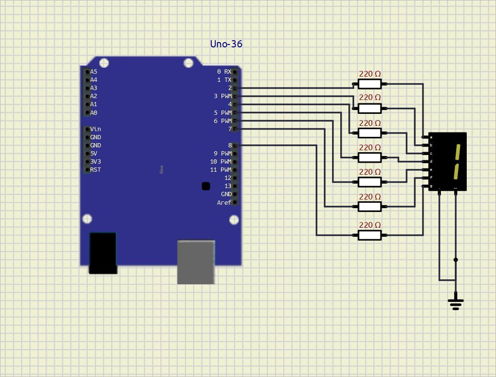

# **EXPERIMENT – 0 GO FURTHER – 2**

## **PROJECT NAME**

**7 Segment Display Interfacing with Arduino UNO**

---

## **OBJECTIVE / PROBLEM STATEMENT**

The objective of this project is to interface a common cathode 7-segment display with Arduino UNO and display numbers sequentially.

This experiment helps in understanding:
- 7-segment display interfacing
- Digital output control
- Number display logic
- Multi-pin control using Arduino

---

## **COMPONENTS USED**

| Component | Quantity |
|---|---|
| Arduino UNO | 1 |
| 7 Segment Display (Common Cathode) | 1 |
| 220Ω Resistors | 7 |
| Jumper Wires | Required |
| Breadboard | 1 |

---

## **PIN CONNECTIONS**

| 7 Segment Pin | Arduino Pin |
|---|---|
| a | D2 |
| b | D3 |
| c | D4 |
| d | D5 |
| e | D6 |
| f | D7 |
| g | D8 |

---

## **SOFTWARE USED**

- Arduino IDE
- SimulIDE

---

## **CIRCUIT DIAGRAM**
 


---

## **MAIN ARDUINO CODE**

```cpp
// 7 Segment Display with Arduino UNO
// Common Cathode Display

int a = 2;
int b = 3;
int c = 4;
int d = 5;
int e = 6;
int f = 7;
int g = 8;

void setup() {

  pinMode(a, OUTPUT);
  pinMode(b, OUTPUT);
  pinMode(c, OUTPUT);
  pinMode(d, OUTPUT);
  pinMode(e, OUTPUT);
  pinMode(f, OUTPUT);
  pinMode(g, OUTPUT);

}

void loop() {

  // Display 0
  digitalWrite(a, HIGH);
  digitalWrite(b, HIGH);
  digitalWrite(c, HIGH);
  digitalWrite(d, HIGH);
  digitalWrite(e, HIGH);
  digitalWrite(f, HIGH);
  digitalWrite(g, LOW);

  delay(1000);

  // Display 1
  digitalWrite(a, LOW);
  digitalWrite(b, HIGH);
  digitalWrite(c, HIGH);
  digitalWrite(d, LOW);
  digitalWrite(e, LOW);
  digitalWrite(f, LOW);
  digitalWrite(g, LOW);

  delay(1000);

  // Display 2
  digitalWrite(a, HIGH);
  digitalWrite(b, HIGH);
  digitalWrite(c, LOW);
  digitalWrite(d, HIGH);
  digitalWrite(e, HIGH);
  digitalWrite(f, LOW);
  digitalWrite(g, HIGH);

  delay(1000);

  // Display 3
  digitalWrite(a, HIGH);
  digitalWrite(b, HIGH);
  digitalWrite(c, HIGH);
  digitalWrite(d, HIGH);
  digitalWrite(e, LOW);
  digitalWrite(f, LOW);
  digitalWrite(g, HIGH);

  delay(1000);

}
```

---

## **WORKING PRINCIPLE**

1. The 7-segment display segments are connected to Arduino digital pins D2 to D8.

2. Each segment is controlled individually using `digitalWrite()`.

3. Depending on which segments are turned ON or OFF, different numbers are displayed.

4. The Arduino sequentially displays:
   - 0
   - 1
   - 2
   - 3

5. Each number remains visible for 1 second using `delay(1000)`.

6. The sequence repeats continuously.

---

## **WHAT I LEARN**

- Interfacing a 7-segment display with Arduino UNO
- Common cathode display working principle
- Using multiple digital output pins
- Number display logic using segments
- Arduino digital output voltage is approximately 5V
- Recommended current per pin is 20mA
- Typical LED segment current is around 10mA to 20mA

---

## **ADVANTAGES**

- Simple number display system
- Easy to understand segment logic
- Useful for beginners
- Low-cost implementation

---

## **APPLICATIONS**

- Digital counters
- Timer displays
- Calculator displays
- Embedded display systems
- Electronic meters

---

## **CONCLUSION**

The 7-segment display was successfully interfaced with Arduino UNO.

The display sequentially showed numbers from 0 to 3 by controlling individual segments through Arduino digital pins. This project helped in understanding display interfacing and segment control logic.

---

## **REFERENCES**

1. Arduino Official Website  
https://www.arduino.cc/

2. Arduino UNO Documentation  
https://docs.arduino.cc/hardware/uno-rev3/

3. 7 Segment Display Basics  
https://www.electronics-tutorials.ws/blog/7-segment-display-tutorial.html

4. Arduino Tutorials  
https://www.arduino.cc/en/Tutorial/HomePage