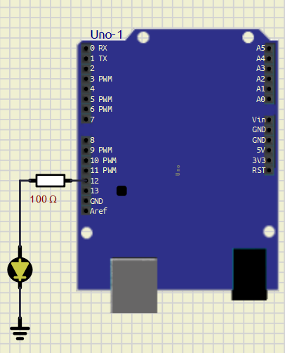

# **EXPERIMENT – 0 Introduction to Arduino**

## PROJECT NAME

**LED Blinking System**

---

## OBJECTIVE / PROBLEM STATEMENT

The objective of this experiment is to interface an LED with Arduino UNO and make the LED blink continuously at a fixed interval.

This experiment helps in understanding:
- Digital output pins of Arduino
- Basic Arduino programming structure
- Use of functions in Arduino
- Timing control using `delay()`

---

## COMPONENTS USED

| Component | Quantity |
|---|---|
| Arduino UNO | 1 |
| LED | 1 |
| 100Ω Resistor | 1 |
| Breadboard | 1 |
| Jumper Wires | Required |

---

## PIN CONNECTIONS

| Device | Arduino Pin |
|---|---|
| LED Positive Terminal | D12 |
| LED Negative Terminal | GND |

---

## SOFTWARE USED

- Arduino IDE
- [SimulIDE](./led_flash.sim1)

---

## CIRCUIT DIAGRAM



---

## MAIN ARDUINO CODE

```cpp
#define led 12 //Led Pin 12 

void setup() {
    pinMode(led, OUTPUT);
}

void loop() {
    toggle_led();
}

void toggle_led()
{
    digitalWrite(led, HIGH);
    delay(1000);

    digitalWrite(led, LOW);
    delay(1000);
}
```

---

## WORKING PRINCIPLE

1. The LED is connected to digital pin D12 of Arduino UNO.

2. In the `setup()` function, pin D12 is configured as an output pin using `pinMode()`.

3. The `loop()` function continuously calls the `toggle_led()` function.

4. Inside the `toggle_led()` function:
   - The LED turns ON using `digitalWrite(HIGH)`
   - Arduino waits for 1 second using `delay(1000)`
   - The LED turns OFF using `digitalWrite(LOW)`
   - Arduino again waits for 1 second

5. This process repeats continuously, causing the LED to blink repeatedly.

---

## ADVANTAGES

- Simple beginner-level Arduino project
- Easy to understand digital output control
- Helps in learning function-based programming
- Useful for testing Arduino boards

---

## APPLICATIONS

- Status indication systems
- Warning indicators
- Signal systems
- Embedded systems learning
- Arduino beginner projects

---
## WHAT I LEARN

- Arduino UNO digital pins give approximately 5V output
- Recommended current per digital pin is 20mA
- Maximum current per digital pin is 40mA
- Typical LED operating current is around 10mA to 20mA
- LEDs should be connected using a current limiting resistor
- Basic LED interfacing with Arduino UNO
---
## CONCLUSION

The LED Blinking System using Arduino UNO was successfully implemented and tested.

The LED blinked continuously with a delay of 1 second ON and 1 second OFF. This experiment helped in understanding basic Arduino programming, digital output control, and hardware interfacing.

---

## REFERENCES

1. Arduino Official Website  
https://www.arduino.cc/

2. Arduino UNO Documentation  
https://docs.arduino.cc/hardware/uno-rev3/

3. Arduino Tutorials  
https://www.arduino.cc/en/Tutorial/HomePage

4. Arduino IDE Documentation  
https://docs.arduino.cc/software/ide/

5. SimulIDE  
https://simulide.com/