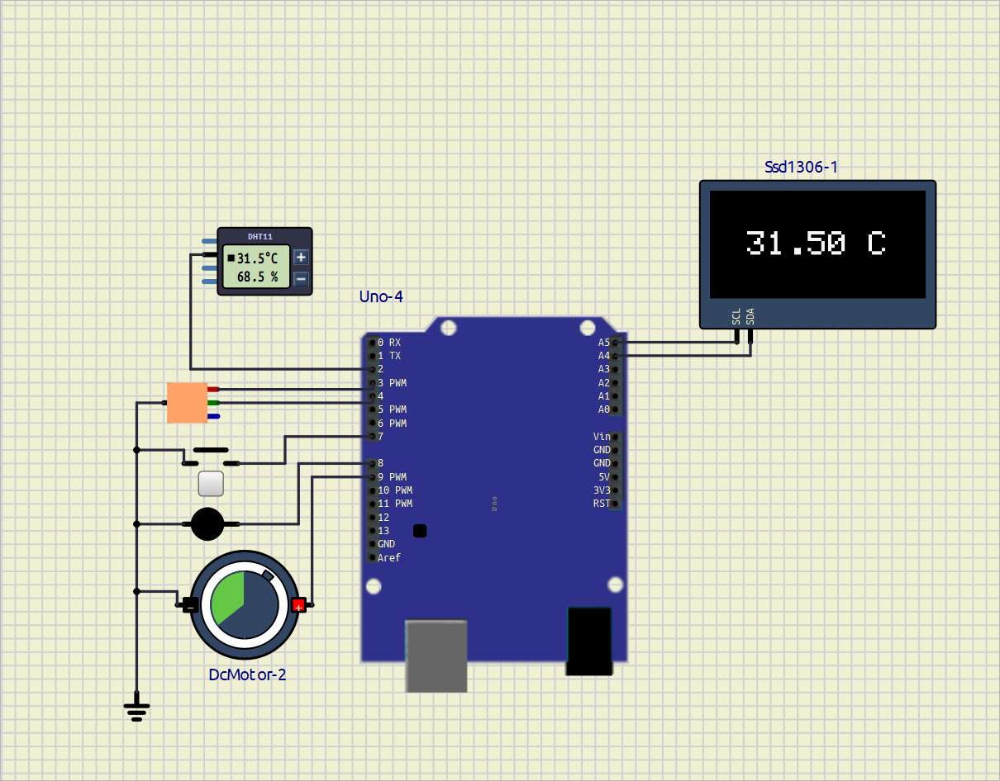

# **EXPERIMENT – 1 INTERFACING WITH ARDUINO**

## PROJECT NAME

**Digital Temperature Monitoring System**

---

## OBJECTIVE / PROBLEM STATEMENT

The main objective of this project is to design a smart temperature monitoring system using Arduino UNO and a DHT11 temperature sensor.

The system continuously measures room temperature and displays the live temperature value on an SSD1306 OLED display. According to the temperature value, the system automatically controls cooling and heating devices such as a fan and heater.

A push button is also provided to turn the complete system ON or OFF manually.

---

## COMPONENTS USED

| Component | Quantity |
|---|---|
| Arduino UNO | 1 |
| DHT11 Temperature Sensor | 1 |
| SSD1306 OLED Display | 1 |
| Red LED | 1 |
| Green LED | 1 |
| DC Fan / Motor | 1 |
| Heater / Bulb | 1 |
| Push Button | 1 |
| Jumper Wires | Required |

---

## PIN CONNECTIONS

| Device | Arduino Pin |
|---|---|
| DHT11 Data Pin | D2 |
| Red LED | D3 |
| Green LED | D4 |
| Push Button | D7 |
| Heater | D8 |
| Fan | D9 |
| OLED SDA | A4 |
| OLED SCL | A5 |

---

## SOFTWARE USED

- Arduino IDE
- SimulIDE

---

## CIRCUIT DIAGRAM



---

## REQUIRED LIBRARIES

```cpp
#include <Wire.h>
#include <Adafruit_GFX.h>
#include <Adafruit_SSD1306.h>
#include <DHT.h>
```

---

## MAIN ARDUINO CODE

```md
[Code](/Exp-1/smart_temp_controler/temp_sys.ino)
```

````cpp
#include <Wire.h>                  // I2C communication library
#include <Adafruit_GFX.h>          // Graphics library for OLED display
#include <Adafruit_SSD1306.h>      // SSD1306 OLED display driver
#include <DHT.h>                   // DHT temperature and humidity sensor library

// OLED display dimensions
#define SCREEN_WIDTH 128
#define SCREEN_HEIGHT 64

// DHT11 sensor configuration
#define DHTPIN 2                   // DHT11 data pin connected to Arduino pin 2
#define DHTTYPE DHT11              // Sensor type

// Create DHT sensor object
DHT dht(DHTPIN, DHTTYPE);

// Create OLED display object
Adafruit_SSD1306 display(
  SCREEN_WIDTH,
  SCREEN_HEIGHT,
  &Wire,
  -1                             // Reset pin not used
);

// Variable to store system ON/OFF state
bool systemON = false;

void setup()
{
  // Initialize DHT sensor
  dht.begin();

  // Initialize OLED display at I2C address 0x3C
  display.begin(SSD1306_SWITCHCAPVCC, 0x3C);

  // Clear display buffer
  display.clearDisplay();

  // Output pins for LEDs / indicators
  pinMode(3, OUTPUT);
  pinMode(4, OUTPUT);
  pinMode(9, OUTPUT);
  pinMode(8, OUTPUT);

  // Push button input with internal pull-up resistor
  pinMode(7, INPUT_PULLUP);
}

void loop()
{
  // Toggle system state when button is pressed
  if (digitalRead(7) == LOW)
  {
    systemON = !systemON;

    // Simple debounce delay
    delay(300);
  }

  // Execute only when system is ON
  if (systemON)
  {
    // Read temperature from DHT11 sensor
    float temp = dht.readTemperature();

    // Clear previous display content
    display.clearDisplay();

    // Set text size and color
    display.setTextSize(2);
    display.setTextColor(WHITE);

    // Create temperature string
    String text = String(temp) + " C";

    // Calculate coordinates to center the text
    int x = (128 - (text.length() * 12)) / 2;
    int y = (64 - 16) / 2;

    // Set cursor position
    display.setCursor(x, y);

    // Print temperature value
    display.print(text);

    // Update OLED display
    display.display();

    // Temperature threshold check
    if (temp >= 28)
    {
      // High temperature indication
      digitalWrite(3, HIGH);
      digitalWrite(4, LOW);

      digitalWrite(9, HIGH);
      digitalWrite(8, LOW);
    }
    else
    {
      // Normal temperature indication
      digitalWrite(3, LOW);
      digitalWrite(4, HIGH);

      digitalWrite(9, LOW);
      digitalWrite(8, HIGH);
    }
  }
  else
  {
    // Turn OFF all outputs when system is OFF
    digitalWrite(3, LOW);
    digitalWrite(4, LOW);

    digitalWrite(9, LOW);
    digitalWrite(8, LOW);

    // Clear OLED display
    display.clearDisplay();
    display.display();
  }

  // Update interval
  delay(1000);
}
````
## WORKING PRINCIPLE

1. The push button is used to turn the complete system ON or OFF.

2. When the system is ON, the DHT11 sensor continuously measures room temperature.

3. The measured temperature value is displayed on the OLED screen in real time.

4. The Arduino UNO compares the measured temperature with the predefined threshold temperature value.

5. If the temperature becomes greater than or equal to 28°C:
   - Red LED turns ON
   - Fan starts running automatically
   - Heater turns OFF

6. If the temperature becomes lower than 28°C:
   - Green LED turns ON
   - Heater turns ON automatically
   - Fan turns OFF

7. The OLED display continuously updates the live temperature reading.

8. When the push button is pressed again:
   - The complete system turns OFF
   - OLED display becomes blank
   - LEDs turn OFF
   - Fan and heater stop working

---

## ADVANTAGES

- Automatic temperature control
- Real-time temperature monitoring
- Easy ON/OFF operation
- Low-cost implementation
- User-friendly system
- Useful for smart automation

---

## APPLICATIONS

- Smart room temperature control
- Automatic cooling systems
- Automatic heating systems
- Industrial temperature monitoring
- Home automation projects
- Embedded systems learning

---

## CONCLUSION

The Digital Temperature Monitoring System using Arduino UNO and DHT11 sensor was successfully implemented and tested in SimulIDE.

The system continuously monitored temperature and automatically controlled the fan and heater according to the temperature value. The OLED display successfully showed live temperature readings, and the push button provided convenient ON/OFF control of the complete system.

This project helped in understanding:
- Arduino interfacing
- Sensor interfacing
- OLED display handling
- Embedded system automation
- Temperature-based control systems

---

## REFERENCES

1. Arduino UNO Documentation  
https://docs.arduino.cc/hardware/uno-rev3/

2. DHT11 Sensor Documentation  
https://components101.com/sensors/dht11-temperature-sensor

3. Adafruit SSD1306 Library  
https://github.com/adafruit/Adafruit_SSD1306

4. Adafruit GFX Library  
https://github.com/adafruit/Adafruit-GFX-Library

5. Arduino DHT Sensor Library  
https://docs.arduino.cc/libraries/dht-sensor-library/

6. Arduino UNO Pinout  
https://deepbluembedded.com/arduino-uno-pinout/