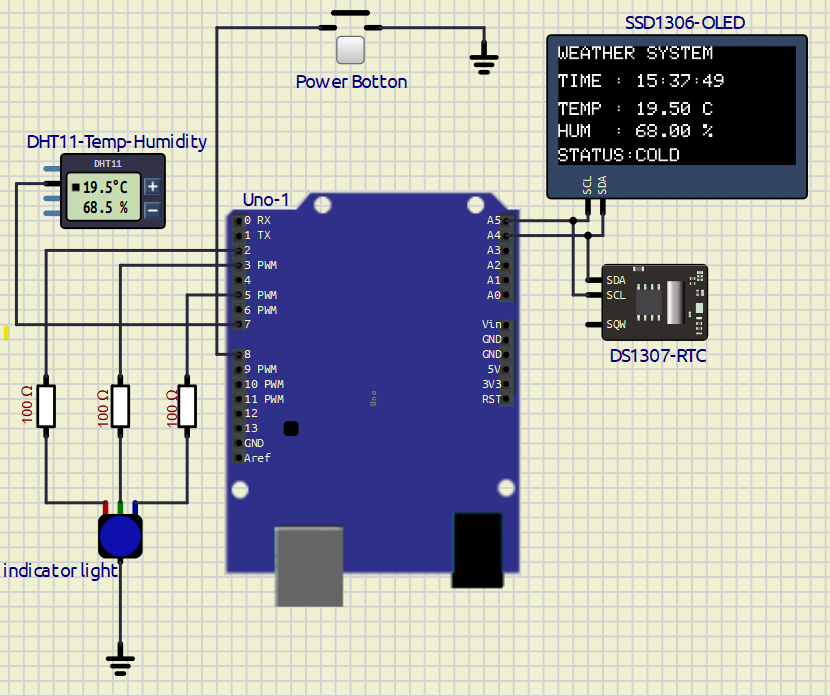
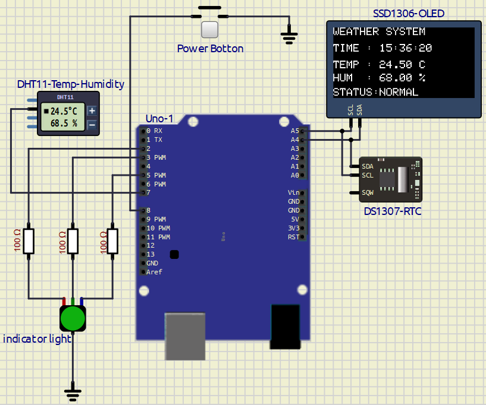
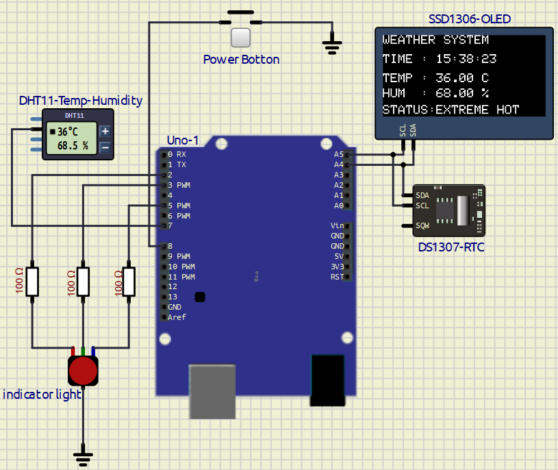

# **EXPERIMENT – 1 Interfacing With Arduino**

---

## PROJECT NAME

**Weather Forecasting System with Extreme Temperature Indicator**

---

## OBJECTIVE / PROBLEM STATEMENT

This project monitors environmental temperature and humidity using a DHT11 sensor and predicts weather conditions based on temperature values.  

The system uses RGB LED indicators to show:
- Extreme Hot Weather
- Normal Weather
- Cold Weather

A DS1307 RTC module provides real-time clock information, and an SSD1306 OLED display shows:
- Current Time
- Temperature
- Humidity
- Weather Status

A push button is also used as a master power control for turning the complete system ON and OFF.

---

## COMPONENTS USED

| Component | Quantity |
|---|---|
| Arduino UNO | 1 |
| DHT11 Sensor | 1 |
| DS1307 RTC Module | 1 |
| SSD1306 OLED Display | 1 |
| RGB LED | 1 |
| Push Button | 1 |
| Resistors (100Ω) | 3 |
| Jumper Wires | Required |
| Breadboard | 1 |

---

## PIN CONNECTIONS

| Device | Arduino Pin |
|---|---|
| DHT11 Data Pin | D7 |
| Red LED | D2 |
| Green LED | D3 |
| Blue LED | D5 |
| Power Button | D8 |
| OLED SDA | A4 |
| OLED SCL | A5 |
| RTC SDA | A4 |
| RTC SCL | A5 |

---

## RGB LED CONNECTION

| RGB Pin | Connection |
|---|---|
| Red Pin | D2 through 100Ω |
| Green Pin | D3 through 100Ω |
| Blue Pin | D5 through 100Ω |
| Common Cathode | GND |

---

## SOFTWARE USED

- Arduino IDE
- SimulIDE

---

## CIRCUIT DIAGRAM


---

## REQUIRED LIBRARIES

```cpp
#include <Wire.h>
#include <RTClib.h>
#include <DHT.h>
#include <Adafruit_GFX.h>
#include <Adafruit_SSD1306.h>
```

---

## MAIN ARDUINO CODE

[Code](/Exp-7/weather_forecast_system/weather_forecast_system.ino)

```cpp
#include <Wire.h>                  // I2C communication library
#include <RTClib.h>                // RTC DS1307 library
#include <DHT.h>                   // DHT temperature/humidity sensor library
#include <Adafruit_GFX.h>          // Graphics library for OLED
#include <Adafruit_SSD1306.h>      // SSD1306 OLED driver

// OLED display dimensions
#define SCREEN_WIDTH 128
#define SCREEN_HEIGHT 64

// Create OLED display object
Adafruit_SSD1306 display(
  SCREEN_WIDTH,
  SCREEN_HEIGHT,
  &Wire,
  -1                            // Reset pin not used
);

// Create RTC object
RTC_DS1307 rtc;

// DHT11 sensor configuration
#define DHTPIN 7
#define DHTTYPE DHT11

// Create DHT sensor object
DHT dht(DHTPIN, DHTTYPE);

// RGB LED pin definitions
#define RED_LED      2
#define GREEN_LED    3
#define BLUE_LED     5

// Push button used to turn system ON/OFF
#define POWER_BUTTON 8

// Stores current system state
bool systemState = false;

// Used for button edge detection
bool lastButtonState = HIGH;

void setup()
{
  // Configure RGB LED pins as outputs
  pinMode(RED_LED, OUTPUT);
  pinMode(GREEN_LED, OUTPUT);
  pinMode(BLUE_LED, OUTPUT);

  // Configure button input with internal pull-up resistor
  pinMode(POWER_BUTTON, INPUT_PULLUP);

  // Initialize I2C communication
  Wire.begin();

  // Initialize RTC module
  rtc.begin();

  // Initialize DHT11 sensor
  dht.begin();

  // Uncomment once to set RTC time from PC compile time
  // rtc.adjust(DateTime(F(__DATE__), F(__TIME__)));

  // Initialize OLED display
  if (!display.begin(SSD1306_SWITCHCAPVCC, 0x3C))
  {
    // Halt execution if OLED initialization fails
    while (1);
  }

  // Clear display buffer
  display.clearDisplay();
  display.display();
}

void loop()
{
  // Read current button state
  bool buttonState = digitalRead(POWER_BUTTON);

  // Detect button press (falling edge)
  if (
      buttonState == LOW &&
      lastButtonState == HIGH
     )
  {
    // Debounce delay
    delay(50);

    // Toggle system state
    systemState = !systemState;

    if (systemState == true)
    {
      // Display POWER ON message
      display.clearDisplay();

      display.setTextSize(2);
      display.setTextColor(WHITE);

      display.setCursor(10, 25);
      display.println("POWER ON");

      display.display();

      delay(1000);
    }
    else
    {
      // Display POWER OFF message
      display.clearDisplay();

      display.setTextSize(2);
      display.setTextColor(WHITE);

      display.setCursor(10, 25);
      display.println("POWER OFF");

      display.display();

      delay(1000);

      // Clear screen after shutdown message
      display.clearDisplay();
      display.display();
    }
  }

  // Save current button state for next loop iteration
  lastButtonState = buttonState;

  // If system is OFF, disable all LEDs and exit loop
  if (systemState == false)
  {
    digitalWrite(RED_LED, LOW);
    digitalWrite(GREEN_LED, LOW);
    digitalWrite(BLUE_LED, LOW);

    return;
  }

  // Read current date and time from RTC
  DateTime now = rtc.now();

  // Read temperature and humidity from DHT11
  float temperature = dht.readTemperature();
  float humidity = dht.readHumidity();

  // Variable to store weather status text
  String statusText;

  // Temperature-based status indication
  if (temperature > 35)
  {
    // Hot condition → Red LED
    digitalWrite(RED_LED, HIGH);
    digitalWrite(GREEN_LED, LOW);
    digitalWrite(BLUE_LED, LOW);

    statusText = "EXTREME HOT";
  }

  else if (temperature < 20)
  {
    // Cold condition → Blue LED
    digitalWrite(RED_LED, LOW);
    digitalWrite(GREEN_LED, LOW);
    digitalWrite(BLUE_LED, HIGH);

    statusText = "COLD";
  }

  else
  {
    // Normal condition → Green LED
    digitalWrite(RED_LED, LOW);
    digitalWrite(GREEN_LED, HIGH);
    digitalWrite(BLUE_LED, LOW);

    statusText = "NORMAL";
  }

  // ---------------- OLED DISPLAY ----------------

  display.clearDisplay();

  display.setTextSize(1);
  display.setTextColor(WHITE);

  // Project title
  display.setCursor(0, 0);
  display.println("WEATHER SYSTEM");

  // Display current time
  display.setCursor(0, 15);
  display.print("TIME : ");

  print2digit(now.hour());
  display.print(":");

  print2digit(now.minute());
  display.print(":");

  print2digit(now.second());

  // Display temperature
  display.setCursor(0, 30);
  display.print("TEMP : ");
  display.print(temperature);
  display.println(" C");

  // Display humidity
  display.setCursor(0, 42);
  display.print("HUM  : ");
  display.print(humidity);
  display.println(" %");

  // Display weather status
  display.setCursor(0, 55);
  display.print("STATUS:");
  display.println(statusText);

  // Update OLED screen
  display.display();

  // Refresh delay
  delay(50);
}

// Function to print numbers with leading zero
// Example: 7 → 07
void print2digit(int number)
{
  if (number < 10)
  {
    display.print("0");
  }

  display.print(number);
}
```

---

## WORKING PRINCIPLE

1. The system starts with a blank OLED screen.
2. Pressing the power button:
   - Turns the system ON
   - Displays "POWER ON"
3. DHT11 sensor continuously reads:
   - Temperature
   - Humidity
4. DS1307 RTC module provides:
   - Real-time clock
5. OLED displays:
   - Time
   - Temperature
   - Humidity
   - Weather Status
6. RGB LED indicates weather condition:
   - Red LED → Extreme Hot
   - Green LED → Normal Weather
   - Blue LED → Cold Weather
7. Pressing the power button again:
   - Displays "POWER OFF"
   - Turns OFF all LEDs
   - OLED returns to black screen

---

## TEMPERATURE INDICATOR LOGIC

| Temperature | LED Status | Weather |
|---|---|---|
| > 35°C | Red LED ON | Extreme Hot |
| 20°C – 35°C | Green LED ON | Normal |
| < 20°C | Blue LED ON | Cold |

---


## OUTPUT

### System - COLD ( Temp < 20 )


### System - Normal ( Temp > 20 & < 36 )


### System - Extream Hot ( Temp > 35 )

---

## ADVANTAGES

- Real-time weather monitoring
- Simple embedded system design
- RGB visual indication
- RTC-based real-time display
- Easy ON/OFF control
- Low-cost implementation
- User-friendly interface

---

## APPLICATIONS

- Smart weather stations
- Environmental monitoring
- Temperature warning systems
- Industrial monitoring
- Home automation systems
- Embedded systems learning

---

## CONCLUSION

The Weather Forecasting System using Arduino UNO, DHT11 sensor, DS1307 RTC module, SSD1306 OLED display, RGB LED, and push-button control was successfully implemented in SimulIDE.

The system correctly monitors weather conditions, displays real-time environmental information, and visually indicates temperature conditions using RGB LEDs.

During this experiment, I learned:
- Sensor interfacing
- OLED interfacing
- RTC interfacing
- RGB LED control
- Push-button logic
- Embedded system design

---

## REFERENCES

1. Arduino UNO Documentation  
https://docs.arduino.cc/hardware/uno-rev3/

2. DHT11 Sensor Documentation  
https://components101.com/sensors/dht11-temperature-sensor

3. DS1307 RTC Datasheet  
https://datasheets.maximintegrated.com/en/ds/DS1307.pdf

4. Adafruit SSD1306 Library  
https://github.com/adafruit/Adafruit_SSD1306

5. Adafruit GFX Library  
https://github.com/adafruit/Adafruit-GFX-Library

6. RTClib Documentation  
https://github.com/adafruit/RTClib

---
### Ganesh Mahata 2022BB1197