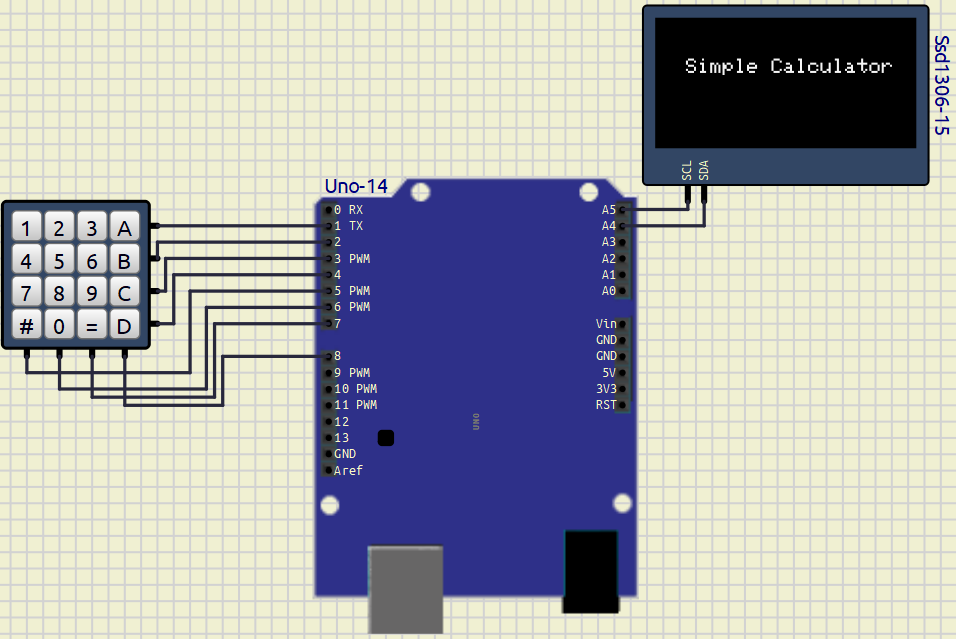
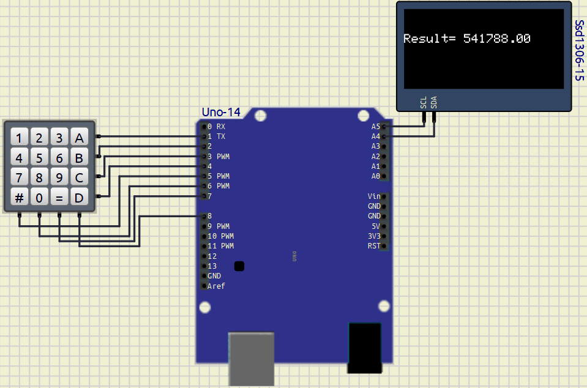

# EXPERIMENT– 2 Calculator

---

## PROJECT NAME

Simple Calculator Using Arduino UNO, 4x4 Keypad and SSD1306 OLED Display

---

## OBJECTIVE / PROBLEM STATEMENT

This project implements a simple calculator using Arduino UNO, a 4x4 keypad, and an SSD1306 OLED display. The calculator performs basic arithmetic operations such as addition, subtraction, multiplication, and division. The result is displayed on the OLED screen.

---

## COMPONENTS USED

| Component | Quantity |
|---|---|
| Arduino UNO | 1 |
| 4x4 Keypad | 1 |
| SSD1306 OLED Display | 1 |
| Jumper Wires | Required |
| Breadboard | 1 |

---

## PIN CONNECTIONS

### 4x4 KEYPAD CONNECTIONS

| Keypad Pin | Arduino Pin |
|---|---|
| R1 | D1 |
| R2 | D2 |
| R3 | D3 |
| R4 | D4 |
| C1 | D5 |
| C2 | D6 |
| C3 | D7 |
| C4 | D8 |

### Symbols mapped operators
|Symbol| Operation |
|---|---|
| A | + |
| B | - |
| C | * |
| D | / |
| # | AC| 

---

### SSD1306 OLED DISPLAY CONNECTIONS

| OLED Pin | Arduino Pin |
|---|---|
| VCC | 5V |
| GND | GND|
| SDA | A4 | 
| SCL | A5 |

---

## SOFTWARE USED

- Arduino IDE
- SimulIDE

---

## CIRCUIT DIAGRAM


### Example:




---

## REQUIRED LIBRARIES

```cpp
#include <Wire.h>
#include <Adafruit_GFX.h>
#include <Adafruit_SSD1306.h>
#include <Keypad.h>
```

---

## MAIN ARDUINO CODE

```cpp
// =======================================================
// SIMPLE CALCULATOR USING:
// 1. Arduino UNO
// 2. 4x4 Keypad
// 3. SSD1306 OLED Display
// =======================================================

// ---------------- LIBRARIES ----------------
#include <Wire.h>
#include <Adafruit_GFX.h>
#include <Adafruit_SSD1306.h>
#include <Keypad.h>

// ---------------- OLED SETTINGS ----------------
#define SCREEN_WIDTH 128
#define SCREEN_HEIGHT 64

// Create OLED display object
Adafruit_SSD1306 display(SCREEN_WIDTH, SCREEN_HEIGHT, &Wire, -1);

// ---------------- KEYPAD SETTINGS ----------------

// Keypad size
const byte ROWS = 4;
const byte COLS = 4;

// Keypad layout
char keys[ROWS][COLS] = {
  {'1', '2', '3', '+'},
  {'4', '5', '6', '-'},
  {'7', '8', '9', '*'},
  {'#', '0', '=', '/'}
};

// Arduino pins connected to keypad
byte rowPins[ROWS] = {1, 2, 3, 4};   // R1 R2 R3 R4
byte colPins[COLS] = {5, 6, 7, 8};   // C1 C2 C3 C4

// Create keypad object
Keypad keypad = Keypad(makeKeymap(keys),
                       rowPins,
                       colPins,
                       ROWS,
                       COLS);

// ---------------- VARIABLES ----------------

// First number
String num1 = "";

// Second number
String num2 = "";

// Operator
char op;

// Result
float result;

// True after operator pressed
bool operatorPressed = false;

// Full expression for display
String expression = "";

// =======================================================
// SETUP
// =======================================================
void setup() {

  // Start OLED display
  display.begin(SSD1306_SWITCHCAPVCC, 0x3C);

  // Clear screen
  display.clearDisplay();

  // Text settings
  display.setTextSize(1.8);
  display.setTextColor(WHITE);

  // Welcome message
  display.setCursor(15, 20);
  display.println("Simple Calculator");

  display.display();

  delay(2000);

  display.clearDisplay();
  display.display();
}

// =======================================================
// LOOP
// =======================================================
void loop() {

  // Read pressed key
  char key = keypad.getKey();

  // If key pressed
  if (key) {

    // ===================================================
    // CLEAR EVERYTHING
    // ===================================================
    if (key == '#') {

      num1 = "";
      num2 = "";
      expression = "";
      operatorPressed = false;
      result = 0;

      display.clearDisplay();
      display.display();
    }

    // ===================================================
    // IF NUMBER PRESSED
    // ===================================================
    else if (isDigit(key)) {

      // Store first number
      if (!operatorPressed) {
        num1 += key;
      }

      // Store second number
      else {
        num2 += key;
      }

      // Add to expression
      expression += key;

      // Show on display
      updateDisplay(expression);
    }

    // ===================================================
    // IF OPERATOR PRESSED
    // ===================================================
    else if (key == '+' || key == '-' ||
             key == '*' || key == '/') {

      // Allow only one operator
      if (!operatorPressed && num1 != "") {

        op = key;
        operatorPressed = true;

        expression += key;

        updateDisplay(expression);
      }
    }

    // ===================================================
    // CALCULATE WHEN '=' PRESSED
    // ===================================================
    else if (key == '=') {

      // Convert strings to numbers
      float n1 = num1.toFloat();
      float n2 = num2.toFloat();

      // Perform calculation
      switch (op) {

        case '+':
          result = n1 + n2;
          break;

        case '-':
          result = n1 - n2;
          break;

        case '*':
          result = n1 * n2;
          break;

        case '/':

          // Prevent divide by zero
          if (n2 != 0) {
            result = n1 / n2;
          }
          else {

            display.clearDisplay();

            display.setCursor(0, 20);
            display.setTextSize(1);
            display.println("ERROR");

            display.display();

            delay(2000);

            return;
          }

          break;
      }

      // Final expression
      expression = "Result= " + String(result);
      // Show result
      updateDisplay(expression);

      // Prepare for next calculation
      num1 = String(result);
      num2 = "";
      operatorPressed = false;

      // Keep only result for next operation
      expression = String(result);
    }
  }
}

// =======================================================
// DISPLAY FUNCTION
// =======================================================
void updateDisplay(String text) {

  display.clearDisplay();

  display.setTextSize(1);
  display.setCursor(0, 20);

  display.println(text);

  display.display();
}

```

---

## WORKING PRINCIPLE

1. The 4x4 keypad is used to enter numbers and operators.
2. Arduino UNO continuously scans the keypad.
3. Entered values are stored as operands.
4. The selected operator determines the operation to be performed.
5. When '=' is pressed:
   - Arduino performs the calculation.
   - Result is displayed on the SSD1306 OLED display.
6. '#' key clears all previous inputs.
7. The process repeats continuously.

---

## OUTPUT

### Startup Screen

```text
Simple Calculator
```

---

### Example Calculation

```text
5+3

Result= 8
```


---

## CONCLUSION

The Simple Calculator using Arduino UNO, 4x4 Keypad, and SSD1306 OLED Display was successfully implemented and tested. The system successfully performs basic arithmetic operations and displays the result on the OLED screen.
During the experiment I faces problem in mapping those keys and assign them their values. I overcome it by the open source resources given in web and arduino forum

---

## REFERENCES

1. Arduino Keypad Library Documentation  
https://www.arduino.cc/reference/en/libraries/keypad/

2. SSD1306 OLED Display Library  
https://github.com/adafruit/Adafruit_SSD1306

3. Arduino UNO Official Documentation  
https://docs.arduino.cc/hardware/uno-rev3/

4. Adafruit GFX Graphics Library  
https://github.com/adafruit/Adafruit-GFX-Library

5. 4×4 Keypad Arduino Code, Pinout & Interfacing Complete Guide
https://robosans.com/learn/embedded/arduino/4x4-keypad-arduino-code-pinout-interfacing-lcd/

---