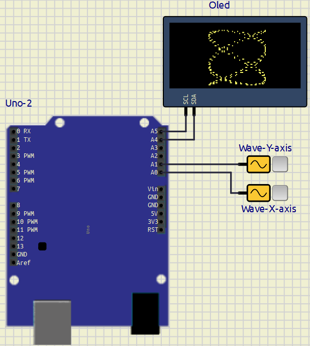

# EXPERIMENT – 03 GO FURTHER – 02

## PROJECT NAME


---

## OBJECTIVE / PROBLEM STATEMENT

This experiment demonstrates the generation and visualization of Lissajous patterns using two sinusoidal signals and an SSD1306 OLED display. The project helps in understanding frequency ratios, phase difference, analog signal sampling, coordinate mapping, and graphical visualization using Arduino UNO.

The experiment demonstrates how different geometric patterns are formed when two sine waves having different frequencies and phase shifts are applied to the X and Y axes of a display system.

---

# COMPONENTS USED

| Component | Quantity |
|------------|------------|
| Arduino UNO | 1 |
| SSD1306 OLED Display | 1 |
| Sine Wave Generator | 2 |
| Connecting Wires | Multiple |
| Oscilloscope (Optional) | 1 |

---

# PIN CONNECTIONS

| Device | Arduino Pin |
|----------|-------------|
| X Signal Input | A0 |
| Y Signal Input | A1 |
| OLED SDA | A4 |
| OLED SCL | A5 |

---

# SOFTWARE USED

- Arduino IDE
- SimulIDE

<div style="break-after: page;"></div>

---

# CIRCUIT DIAGRAM



---

# MAIN ARDUINO CODE

```cpp
#include <Wire.h>
#include <Adafruit_GFX.h>
#include <Adafruit_SSD1306.h>

// ======================================================
// OLED DISPLAY CONFIGURATION
// ======================================================

#define SCREEN_WIDTH 128
#define SCREEN_HEIGHT 64

Adafruit_SSD1306 display(
  SCREEN_WIDTH,
  SCREEN_HEIGHT,
  &Wire,
  -1
);

// ======================================================
// ANALOG INPUT CHANNELS
// ======================================================
//
// A0 receives the signal used for horizontal (X-axis)
// positioning, while A1 receives the signal used for
// vertical (Y-axis) positioning.
//

#define X_IN A0
#define Y_IN A1

// ======================================================
// INITIALIZATION
// ======================================================

void setup()
{
  // Initialize SSD1306 OLED display using I2C address 0x3C
  display.begin(SSD1306_SWITCHCAPVCC, 0x3C);

  // Clear display buffer before starting operation
  display.clearDisplay();
}

// ======================================================
// MAIN EXECUTION LOOP
// ======================================================

void loop()
{
  // Clear previous frame to generate a fresh pattern
  display.clearDisplay();

  // Acquire multiple samples to construct the
  // Lissajous pattern during each refresh cycle
  for(int i = 0; i < 500; i++)
  {
    // Read instantaneous values of both input signals
    int xRaw = analogRead(X_IN);
    int yRaw = analogRead(Y_IN);

    // Scale ADC values to the OLED horizontal range
    int x = map(
      xRaw,
      0,
      940,
      0,
      127
    );

    // Scale ADC values to the OLED vertical range.
    // The coordinate system is inverted so that
    // higher voltages appear toward the top.
    int y = map(
      yRaw,
      0,
      940,
      63,
      0
    );

    // Plot the corresponding coordinate on the display
    display.drawPixel(x, y, WHITE);
  }

  // Transfer the completed frame buffer to the OLED
  display.display();
}
```

---

# WORKING PRINCIPLE

1. Two sinusoidal signals are connected to A0 and A1.
2. Arduino continuously samples both signals using ADC.
3. Signal at A0 controls the X-axis coordinate.
4. Signal at A1 controls the Y-axis coordinate.
5. Values are mapped to OLED screen coordinates.
6. Each coordinate pair is plotted as a pixel.
7. Continuous plotting creates a Lissajous pattern.
8. Pattern shape depends on frequency ratio and phase difference.
---

# WHAT I LEARN
- OLED graphics programming
- Coordinate mapping
- Lissajous curve generation
- Frequency ratio analysis
- Phase difference analysis
- Signal visualization techniques
---

# CONCLUSION

The Lissajous Pattern Generator was successfully implemented using Arduino UNO and SSD1306 OLED display. Two sinusoidal signals were sampled and mapped to X-Y coordinates to generate various Lissajous figures. The experiment demonstrated the relationship between frequency ratio, phase difference, and resulting geometric patterns while improving understanding of signal visualization and embedded graphics programming.

---

# REFERENCES

1. Arduino Official Website

https://www.arduino.cc/

2. SSD1306 OLED Documentation

https://github.com/adafruit/Adafruit_SSD1306

3. Adafruit GFX Library

https://github.com/adafruit/Adafruit-GFX-Library

4. SimulIDE Official Website

https://simulide.com/

5. Lissajous Curves

https://en.wikipedia.org/wiki/Lissajous_curve