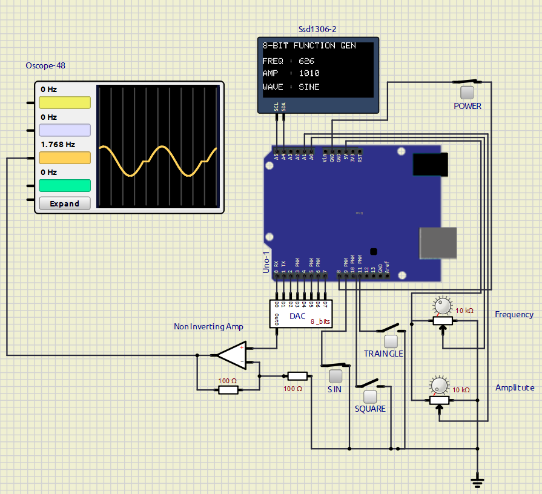

# **EXPERIMENT – 03 GO FURTHER – 01**

## **PROJECT NAME**

8-Bit Arduino Function Generator using DAC and Op-Amp

---

## **OBJECTIVE / PROBLEM STATEMENT**

This experiment helps in understanding waveform generation using Arduino UNO. The project generates sine, square, and triangle waves using an 8-bit DAC system with op-amp buffering and RC filtering. The experiment demonstrates concepts of Direct Digital Synthesis (DDS), Digital-to-Analog Conversion (DAC), waveform sampling, frequency control, amplitude control, and OLED interfacing.

---

## **COMPONENTS USED**

| Component | Quantity |
|---|---|
| Arduino UNO | 1 |
| 8-Bit DAC / R-2R DAC | 1 |
| SSD1306 OLED Display | 1 |
| Op-Amp | 1 |
| 10k Potentiometer | 2 |
| Push Switch | 4 |
| Resistors | Multiple |
| Capacitor | 1 |
| Oscilloscope | 1 |

---

## **PIN CONNECTIONS**

| Device | Arduino Pin |
|---|---|
| DAC D0 | D0 |
| DAC D1 | D1 |
| DAC D2 | D2 |
| DAC D3 | D3 |
| DAC D4 | D4 |
| DAC D5 | D5 |
| DAC D6 | D6 |
| DAC D7 | D7 |
| Power Switch | D8 |
| Sine Wave Switch | D9 |
| Square Wave Switch | D10 |
| Triangle Wave Switch | D11 |
| Frequency Potentiometer | A0 |
| Amplitude Potentiometer | A1 |
| OLED SDA | A4 |
| OLED SCL | A5 |

---

## **SOFTWARE USED**

- Arduino IDE
- SimulIDE


<div style="break-after: page;"></div>

---
## **CIRCUIT DIAGRAM**




---

## **MAIN ARDUINO CODE**

```cpp
/*
Function Generator Using UNO Board (Op-Amp + DAC  8 bit)
*/

#include <Wire.h>
#include <Adafruit_GFX.h>
#include <Adafruit_SSD1306.h>
#include <math.h>


// ======================================================
// OLED SETTINGS
// ======================================================

#define SCREEN_WIDTH 128
#define SCREEN_HEIGHT 64
#define OLED_RESET -1
#define OLED_ADDR 0x3C //OLED I2C working address

Adafruit_SSD1306 display(SCREEN_WIDTH, SCREEN_HEIGHT, &Wire, OLED_RESET);


// ======================================================
// PIN DEFINITIONS
// ======================================================

#define FREQ_POT     A0  //frequency potentiometer connected to A0
#define AMP_POT      A1 // Amplitude potentiometer connected to A1

#define POWER_SW     8  //System Power Botton

#define SINE_SW      9  //sine wave generate
#define SQUARE_SW    10 //square wave generate
#define TRI_SW       11 //Traingular wave generate


// ======================================================
// VARIABLES
// ======================================================

uint8_t sineTable[256]; //formation of sine table

int freqValue;
int ampValue;

int freqDelay;

uint8_t ampScaled;


// ======================================================
// SETUP
// ======================================================

void setup()
{
  // ----------------------------------------------------
  // D0-D7 AS OUTPUT
  // ----------------------------------------------------

  DDRD = 0xFF;//

  PORTD = 0;


  // ----------------------------------------------------
  // SWITCHES
  // ----------------------------------------------------

  pinMode(POWER_SW, INPUT_PULLUP); //Assign Function to all switchs as per ther role

  pinMode(SINE_SW, INPUT_PULLUP);

  pinMode(SQUARE_SW, INPUT_PULLUP);

  pinMode(TRI_SW, INPUT_PULLUP);


  // ----------------------------------------------------
  // OLED START (Initialising Display)
  // ----------------------------------------------------

  display.begin(SSD1306_SWITCHCAPVCC, OLED_ADDR);

  display.clearDisplay(); //clear display

  display.setTextSize(1); //text size set

  display.setTextColor(WHITE); //text colour set

  display.setCursor(0,0); // Set initial coordinnate for displaying text

  display.println("FUNCTION GENERATOR"); //Printing Function Generator

  display.display(); //update display 

  delay(1000); //delay of 1s


  // ----------------------------------------------------
  // BUILD 256 SAMPLE SINE TABLE
  // ----------------------------------------------------

  for(int i=0; i<256; i++)
  {
    float angle;

    angle = (2.0 * PI * i) / 256.0;

    sineTable[i] = (uint8_t)(127.5 + 127.5 * sin(angle));
  }
}


// ======================================================
// MAIN LOOP
// ======================================================

void loop()
{

  // ====================================================
  // POWER SWITCH
  // ====================================================

  if(digitalRead(POWER_SW) == HIGH)
  {
    PORTD = 0;
    display.clearDisplay();

    display.setTextSize(2);

    display.setTextColor(WHITE);

    // "SYSTEM" centered
    display.setCursor(22,10);
    display.println("SYSTEM");

    // "OFF" centered
    display.setCursor(40,35);
    display.println("OFF");

    display.display();
    return;
  }


  // ====================================================
  // READ POTS
  // ====================================================

  freqValue = analogRead(FREQ_POT);

  ampValue  = analogRead(AMP_POT);


  // ====================================================
  // FREQUENCY CONTROL
  // ====================================================

  /*
    smaller delay = higher frequency
  */

  freqDelay = map(freqValue,0,1023,5000,60);
  
  // ====================================================
  // AMPLITUDE CONTROL
  // ====================================================

  ampScaled = map(ampValue,0,1023,0,255);


  // ====================================================
  // WAVEFORM SELECTION
  // ====================================================

  if(digitalRead(SINE_SW) == LOW)
  {
    generateSine();
  }

  else if(digitalRead(SQUARE_SW) == LOW)
  {
    generateSquare();
  }

  else if(digitalRead(TRI_SW) == LOW)
  {
    generateTriangle();
  }

  else
  {
    PORTD = 0;
  }


  // ====================================================
  // OLED UPDATE
  // ====================================================

  updateDisplay();
}


// ======================================================
// AMPLITUDE SCALE FUNCTION
// ======================================================

uint8_t scaleAmplitude(uint8_t value)
{
  return ((unsigned int)value * ampScaled) / 255;
}


// ======================================================
// SINE WAVE
// ======================================================

void generateSine()
{
  for(int i=0; i<256; i++)
  {
    PORTD = scaleAmplitude(sineTable[i]);

    delayMicroseconds(freqDelay);
  }
}


// ======================================================
// TRIANGLE WAVE
// ======================================================

void generateTriangle()
{
  for(int i=0; i<256; i++)
  {
    PORTD = scaleAmplitude(i);

    delayMicroseconds(freqDelay);
  }

  for(int i=255; i>=0; i--)
  {
    PORTD = scaleAmplitude(i);

    delayMicroseconds(freqDelay);
  }
}


// ======================================================
// SQUARE WAVE - FIXED VERSION
// ======================================================

void generateSquare()
{
  uint8_t highLevel;

  highLevel = scaleAmplitude(255);

  // FIXED: High level first, then low level
  PORTD = highLevel;

  delayMicroseconds(freqDelay * 128);

  PORTD = 0;

  delayMicroseconds(freqDelay * 128);
}


// ======================================================
// OLED DISPLAY
// ======================================================

void updateDisplay()
{
  static unsigned long lastUpdate = 0;

  if(millis() - lastUpdate < 150)
  return;

  lastUpdate = millis();


  display.clearDisplay();

  display.setTextSize(1);

  display.setCursor(0,0);

  display.println("8-BIT FUNCTION GEN");


  display.setCursor(0,18);

  display.print("FREQ : ");

  display.println(freqValue);


  display.setCursor(0,32);

  display.print("AMP  : ");

  display.println(ampValue);


  display.setCursor(0,48);

  display.print("WAVE : ");


  if(digitalRead(SINE_SW) == LOW)
  {
    display.println("SINE");
  }

  else if(digitalRead(SQUARE_SW) == LOW)
  {
    display.println("SQUARE");
  }

  else if(digitalRead(TRI_SW) == LOW)
  {
    display.println("TRIANGLE");
  }

  else
  {
    display.println("NONE");
  }


  display.display();
}

```

---

## **WORKING PRINCIPLE**

1. Arduino reads frequency and amplitude values using potentiometers.
2. Waveform type is selected using switches.
3. A sine lookup table stores 256 waveform samples.
4. Arduino sends digital data through PORTD (D0–D7).
5. The DAC converts digital values into analog voltage.
6. The op-amp buffers and stabilizes the waveform.
7. The RC filter smooths the staircase output.
8. The oscilloscope displays the generated waveform.

---

## **WHAT I LEARN**

- Understanding of DAC and DDS concepts
- Fast digital output using PORTD
- Frequency control using timing delay
- Waveform generation using lookup tables
- OLED interfacing with Arduino

---


## **APPLICATIONS**

- Signal testing
- Audio waveform experiments
- Electronics laboratory
- Communication system experiments
- Embedded systems learning
- DAC and waveform analysis

---

## **CONCLUSION**

The function generator was successfully designed and simulated using Arduino UNO, DAC, op-amp, and RC filter. The project demonstrated waveform generation using Direct Digital Synthesis (DDS) and helped in understanding DAC operation, waveform sampling, signal conditioning, and embedded system programming.

---

## **REFERENCES**

1. Arduino Official Website  
https://www.arduino.cc/

2. SSD1306 OLED Documentation  
https://github.com/adafruit/Adafruit_SSD1306

3. Adafruit GFX Library  
https://github.com/adafruit/Adafruit-GFX-Library

4. SimulIDE Official Website  
https://simulide.com/

5. Simple wave form genereate:
  https://docs.arduino.cc/tutorials/due/simple-waveform-generator/