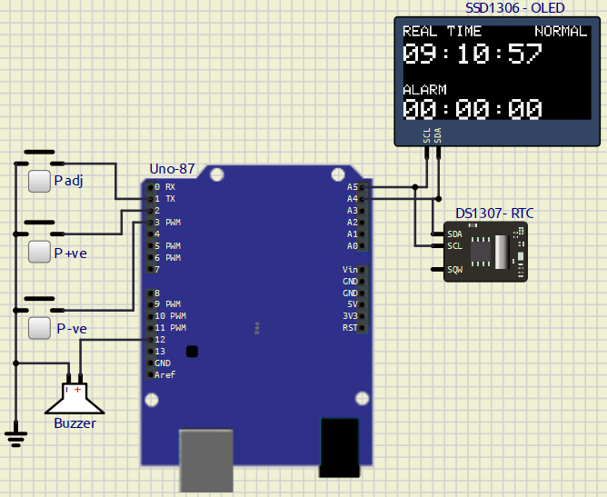

# **EXPERIMENT – 4 Alarm Clock Using RTC and OLED Display**

---

## PROJECT NAME

**Real-Time Alarm Clock Using Arduino UNO, DS1307 RTC Module, SSD1306 OLED Display and Push Buttons**

---

## OBJECTIVE / PROBLEM STATEMENT

To interface a DS1307 Real-Time Clock (RTC) module with Arduino UNO using the I2C communication protocol and display the real-time clock data on an SSD1306 OLED display.

The system also implements an alarm-setting mechanism using push buttons. The user can set the alarm hour, minute, and second using dedicated push-button operations. When the current RTC time matches the preset alarm time, a buzzer sounds continuously until the time changes.

---

## COMPONENTS USED

| Component | Quantity |
|---|---|
| Arduino UNO | 1 |
| DS1307 RTC Module | 1 |
| SSD1306 OLED Display | 1 |
| Push Buttons | 3 |
| Buzzer | 1 |
| Jumper Wires | Required |
| Breadboard | 1 |

---

## PIN CONNECTIONS

### PUSH BUTTON CONNECTIONS

| Push Button | Arduino Pin | Function |
|---|---|---|
| P-adj | D1 | Change Alarm Setting Mode |
| P+ve | D2 | Increase Value |
| P-ve | D3 | Decrease Value |

---

### BUZZER CONNECTION

| Device | Arduino Pin |
|---|---|
| Buzzer (+) | D12 |
| Buzzer (-) | GND |

---

### DS1307 RTC CONNECTIONS

| RTC Pin | Arduino Pin |
|---|---|
| VCC | 5V |
| GND | GND |
| SDA | A4 |
| SCL | A5 |

---

### SSD1306 OLED DISPLAY CONNECTIONS

| OLED Pin | Arduino Pin |
|---|---|
| VCC | 5V |
| GND | GND |
| SDA | A4 |
| SCL | A5 |

---

## SOFTWARE USED

- Arduino IDE
- Proteus / SimulIDE

---

## CIRCUIT DIAGRAM




---

## REQUIRED LIBRARIES

```cpp
#include <Wire.h>
#include <RTClib.h>
#include <Adafruit_GFX.h>
#include <Adafruit_SSD1306.h>
```

---

## BUTTON OPERATION

### P-adj Button Operation

| Number of Press | Operation |
|---|---|
| 1st Press | Activate Alarm Setting Mode |
| 2nd Press | Set Hour |
| 3rd Press | Set Minute |
| 4th Press | Set Second |
| 5th Press | Exit Alarm Setting Mode |

---

### P+ve Button

- Increases selected value

---

### P-ve Button

- Decreases selected value

---

## MAIN ARDUINO CODE

### Code With Comments ---> [Click Here](/Exp-4/file.ino)

```cpp
#include <Wire.h>
#include <RTClib.h>

#include <Adafruit_GFX.h>
#include <Adafruit_SSD1306.h>

#define SCREEN_WIDTH 128
#define SCREEN_HEIGHT 64

Adafruit_SSD1306 display(SCREEN_WIDTH,
                         SCREEN_HEIGHT,
                         &Wire,
                         -1);

RTC_DS1307 rtc;


// BUTTON PINS

#define BTN_ADJ 1
#define BTN_INC 2
#define BTN_DEC 3


// BUZZER PIN

#define BUZZER 12


// ALARM VARIABLES

int alarmHour = 0;
int alarmMinute = 0;
int alarmSecond = 0;


// MODE VARIABLE

/*
   mode = 0 -> Normal Mode
   mode = 1 -> Set Hour
   mode = 2 -> Set Minute
   mode = 3 -> Set Second
*/

int mode = 0;

bool alarmTriggered = false;


// BUTTON STATES

bool lastAdjState = HIGH;
bool lastIncState = HIGH;
bool lastDecState = HIGH;


void setup()
{
  pinMode(BTN_ADJ, INPUT_PULLUP);
  pinMode(BTN_INC, INPUT_PULLUP);
  pinMode(BTN_DEC, INPUT_PULLUP);

  pinMode(BUZZER, OUTPUT);

  digitalWrite(BUZZER, LOW);

  Wire.begin();

  rtc.begin();

  // Uncomment first time only
  // rtc.adjust(DateTime(F(__DATE__), F(__TIME__)));


  if (!display.begin(SSD1306_SWITCHCAPVCC, 0x3C))
  {
    while (1);
  }

  display.clearDisplay();
  display.display();

  delay(1000);
}


void loop()
{
  DateTime now = rtc.now();

  handleButtons();

  checkAlarm(now);

  displayData(now);

  delay(150);
}


void handleButtons()
{
  bool adjState = digitalRead(BTN_ADJ);
  bool incState = digitalRead(BTN_INC);
  bool decState = digitalRead(BTN_DEC);


  // P-ADJ BUTTON

  if (adjState == LOW && lastAdjState == HIGH)
  {
    delay(200);

    mode++;

    if (mode > 4)
    {
      mode = 0;
    }
  }


  // P+ BUTTON

  if (incState == LOW && lastIncState == HIGH)
  {
    delay(200);

    if (mode == 1)
    {
      alarmHour++;

      if (alarmHour > 23)
        alarmHour = 0;
    }

    else if (mode == 2)
    {
      alarmMinute++;

      if (alarmMinute > 59)
        alarmMinute = 0;
    }

    else if (mode == 3)
    {
      alarmSecond++;

      if (alarmSecond > 59)
        alarmSecond = 0;
    }
  }


  // P- BUTTON

  if (decState == LOW && lastDecState == HIGH)
  {
    delay(200);

    if (mode == 1)
    {
      alarmHour--;

      if (alarmHour < 0)
        alarmHour = 23;
    }

    else if (mode == 2)
    {
      alarmMinute--;

      if (alarmMinute < 0)
        alarmMinute = 59;
    }

    else if (mode == 3)
    {
      alarmSecond--;

      if (alarmSecond < 0)
        alarmSecond = 59;
    }
  }


  lastAdjState = adjState;
  lastIncState = incState;
  lastDecState = decState;
}


// CHECK ALARM

void checkAlarm(DateTime now)
{
  // Trigger Alarm

  if (
    now.hour() == alarmHour &&
    now.minute() == alarmMinute &&
    now.second() == alarmSecond
  )
  {
    alarmTriggered = true;
  }


  // Continuous Buzzer

  if (alarmTriggered)
  {
    tone(BUZZER, 1000);
  }


  // Stop Alarm When Time Changes

  if (
    now.hour() != alarmHour ||
    now.minute() != alarmMinute
  )
  {
    alarmTriggered = false;

    noTone(BUZZER);
  }
}


// DISPLAY FUNCTION

void displayData(DateTime now)
{
  display.clearDisplay();

  display.setTextSize(1);
  display.setTextColor(WHITE);


  // REAL TIME

  display.setCursor(0, 0);
  display.println("REAL TIME");

  display.setTextSize(2);

  display.setCursor(0, 12);

  print2digit(now.hour());
  display.print(":");

  print2digit(now.minute());
  display.print(":");

  print2digit(now.second());


  // ALARM TIME

  display.setTextSize(1);

  display.setCursor(0, 40);
  display.println("ALARM");

  display.setTextSize(2);

  display.setCursor(0, 50);

  print2digit(alarmHour);
  display.print(":");

  print2digit(alarmMinute);
  display.print(":");

  print2digit(alarmSecond);


  // MODE DISPLAY

  display.setTextSize(1);

  display.setCursor(90, 0);

  if (mode == 0)
  {
    display.println("NORMAL");
  }

  else if (mode == 1)
  {
    display.println("SET HR");
  }

  else if (mode == 2)
  {
    display.println("SET MIN");
  }

  else if (mode == 3)
  {
    display.println("SET SEC");
  }

  display.display();
}


void print2digit(int number)
{
  if (number < 10)
  {
    display.print("0");
  }

  display.print(number);
}
```

---

## WORKING PRINCIPLE

1. DS1307 RTC module continuously maintains the current real-time clock.
2. Arduino UNO reads the RTC time through I2C communication.
3. SSD1306 OLED display shows:
   - Current Time
   - Alarm Time
   - Current Setting Mode
4. P-adj button changes the alarm setting mode.
5. P+ and P- buttons increase or decrease the selected time unit.
6. Alarm hour, minute, and second are stored in memory.
7. When RTC time matches the alarm time:
   - Arduino activates the buzzer.
   - Buzzer rings continuously.
8. Alarm automatically stops when the time changes.

---

## OUTPUT

## OLED Display

### Real-Time Clock Display

```text
REAL TIME
12:45:30       

ALARM
06:00:00
```

---

### Alarm Trigger

```text
Current Time = Alarm Time
Buzzer Activated
```

---

# FEATURES

- Real-time clock using DS1307 RTC
- Alarm setting functionality
- OLED display output
- Push-button controlled interface
- Continuous buzzer alarm
- I2C communication
- Hour, minute, and second adjustment
- Low-cost embedded system project

---

# ADVANTAGES

- Accurate real-time tracking
- Simple alarm configuration
- Low power consumption
- Easy hardware interfacing
- Compact embedded system
- User-friendly operation

---

# APPLICATIONS

- Digital alarm clocks
- Embedded timing systems
- Reminder systems
- Home automation projects
- Educational Arduino projects
- RTC interfacing experiments

---

# CONCLUSION

The Alarm Clock System using Arduino UNO, DS1307 RTC Module, SSD1306 OLED Display, and push buttons was successfully implemented and tested. The system correctly displays the real-time clock, allows users to set alarm parameters, and activates the buzzer when the alarm time matches the RTC time.

During the experiment, I learned about:
- I2C communication protocol
- RTC interfacing
- OLED display handling
- Push-button interfacing
- Alarm logic implementation in embedded systems

---

# REFERENCES

1. Arduino UNO Official Documentation  
https://docs.arduino.cc/hardware/uno-rev3/

2. DS1307 RTC Module Documentation  
https://datasheets.maximintegrated.com/en/ds/DS1307.pdf

3. RTClib Library Documentation  
https://github.com/adafruit/RTClib

4. Adafruit SSD1306 OLED Library  
https://github.com/adafruit/Adafruit_SSD1306

5. Adafruit GFX Graphics Library  
https://github.com/adafruit/Adafruit-GFX-Library

6. I2C Communication Protocol Tutorial  
https://www.arduino.cc/en/reference/wire

---
### Ganesh Mahata - 2022BB11977 ###