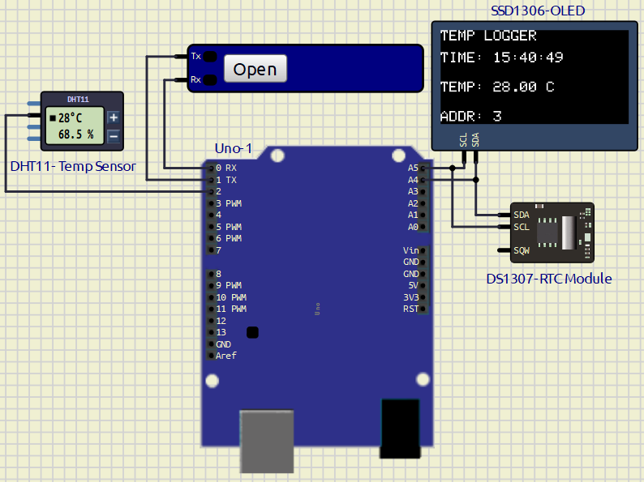

# **EXPERIMENT – 4  ​Using​ ​the​ ​I2C​ ​Bus**

---

## PROJECT NAME

**Temperature Data Logger Using Arduino UNO, DHT11 Sensor, DS1307 RTC Module and SSD1306 OLED Display**

---

## PROBLEM STATEMENT

To design and implement a real-time temperature monitoring and recording system using Arduino UNO. The system continuously reads temperature using a DHT11 sensor and records temperature values every 15 minutes.

The DS1307 RTC module provides accurate real-time timestamps, while the SSD1306 OLED display shows live temperature and time information. The recorded temperature data is stored in Arduino EEPROM memory and transferred to a laptop through USB serial communication.

---

## COMPONENTS USED

| Component | Quantity |
|---|---|
| Arduino UNO | 1 |
| DHT11 Temperature Sensor | 1 |
| DS1307 RTC Module | 1 |
| SSD1306 OLED Display | 1 |
| Jumper Wires | Required |
| Breadboard | 1 |
| USB Cable | 1 |

---

## PIN CONNECTIONS

### DHT11 SENSOR CONNECTIONS

| DHT11 Pin | Arduino Pin |
|---|---|
| DATA | D2 |
| VCC | 5V |
| GND | GND |

---

### DS1307 RTC CONNECTIONS

| RTC Pin | Arduino Pin |
|---|---|
| SDA | A4 |
| SCL | A5 |
| VCC | 5V |
| GND | GND |

---

### SSD1306 OLED CONNECTIONS

| OLED Pin | Arduino Pin |
|---|---|
| SDA | A4 |
| SCL | A5 |
| VCC | 5V |
| GND | GND |

---

## SOFTWARE USED

- Arduino IDE
- SimulIDE

---
## Circuit Diagram



## WORKING PRINCIPLE

1. DHT11 continuously measures temperature.
2. DS1307 RTC provides real-time clock information.
3. Arduino UNO reads:
   - Temperature
   - Current time
4. OLED display shows:
   - Current Time
   - Current Temperature
   - EEPROM Address
5. Every 15 minutes:
   - Temperature value is stored into EEPROM.
   - Data is transferred to laptop through USB serial communication.
6. Serial monitor displays recorded temperature logs.

---
## LIBRARIES USED

```cpp
#include <Wire.h>
#include <RTClib.h>
#include <EEPROM.h>
#include <DHT.h>
#include <Adafruit_GFX.h>
#include <Adafruit_SSD1306.h>
```
---

## MAIN ARDUINO CODE

### Complete Code With Comments---->[Click here](/Exp-4/temp_recorder/file.ino)

```cpp
#include <Wire.h>
#include <RTClib.h>
#include <EEPROM.h>
#include <DHT.h>
#include <Adafruit_GFX.h>
#include <Adafruit_SSD1306.h>

#define SCREEN_WIDTH 128
#define SCREEN_HEIGHT 64

Adafruit_SSD1306 display(
  SCREEN_WIDTH,
  SCREEN_HEIGHT,
  &Wire,
  -1
);

RTC_DS1307 rtc;

#define DHTPIN 2
#define DHTTYPE DHT11

DHT dht(DHTPIN, DHTTYPE);

int eepromAddress = 0;
int lastRecordedMinute = -1;

void setup()
{
  Serial.begin(9600);

  Wire.begin();

  rtc.begin();

  dht.begin();

  // rtc.adjust(DateTime(F(__DATE__), F(__TIME__)));

  if (!display.begin(SSD1306_SWITCHCAPVCC, 0x3C))
  {
    while (1);
  }

  display.clearDisplay();
  display.display();

  Serial.println("TEMP LOGGER STARTED");
}

void loop()
{
  DateTime now = rtc.now();

  float temperature = dht.readTemperature();

  displayData(now, temperature);

  if (
      now.minute() % 15 == 0 &&
      now.minute() != lastRecordedMinute
     )
  {
      EEPROM.write(eepromAddress++, now.hour());

      EEPROM.write(eepromAddress++, now.minute());

      EEPROM.write(eepromAddress++, (int)temperature);

      Serial.print(now.hour());

      Serial.print(":");

      print2digitSerial(now.minute());

      Serial.print(":");

      print2digitSerial(now.second());

      Serial.print(",");

      Serial.print(temperature);

      Serial.println(" C");

      lastRecordedMinute = now.minute();
  }

  delay(1000);
}

void displayData(DateTime now, float temperature)
{
  display.clearDisplay();

  display.setTextSize(1);

  display.setTextColor(WHITE);

  display.setCursor(0, 0);
  display.println("TEMP LOGGER");

  display.setCursor(0, 15);

  display.print("TIME: ");

  print2digit(now.hour());

  display.print(":");

  print2digit(now.minute());

  display.print(":");

  print2digit(now.second());

  display.setCursor(0, 35);

  display.print("TEMP: ");

  display.print(temperature);

  display.println(" C");

  display.setCursor(0, 55);

  display.print("ADDR: ");

  display.print(eepromAddress);

  display.display();
}

void print2digit(int number)
{
  if (number < 10)
  {
    display.print("0");
  }

  display.print(number);
}

void print2digitSerial(int number)
{
  if (number < 10)
  {
    Serial.print("0");
  }

  Serial.print(number);
}
```

---

# OLED OUTPUT

```text
TEMP LOGGER

TIME: 12:15:00

TEMP: 25 C

ADDR: 3
```

---

# SERIAL OUTPUT

```text
12:00:00,25 C
12:01:00,26 C
12:02:00,27 C
```
**Instead of record data each 15min , I record it each 1 min onwards. so this is how its recorded and displayes in serial monitor**


# FEATURES

- Real-time temperature monitoring
- Temperature recording every 15 minutes
- OLED display output
- RTC-based time stamping
- EEPROM data storage
- USB serial data transfer
- Laptop data recording support

---

# ADVANTAGES

- No SD card required
- Low-cost implementation
- Easy USB communication
- Real-time monitoring
- Permanent EEPROM storage
- Simple embedded system design

---

# APPLICATIONS

- Weather monitoring systems
- Laboratory temperature logging
- Industrial monitoring systems
- Greenhouse monitoring
- Environmental monitoring
- Embedded system experiments

---

# CONCLUSION

The Temperature Data Logger System using Arduino UNO, DHT11 sensor, DS1307 RTC module, and SSD1306 OLED display was successfully implemented and tested. The system accurately records temperature every 15 minutes and transfers the data to a laptop through USB serial communication.

During this experiment, I learned:
- RTC interfacing
- OLED interfacing
- EEPROM memory handling
- Serial communication
- Temperature sensing
- Data logging techniques in embedded systems

---

# REFERENCES

1. Arduino UNO Official Documentation  
https://docs.arduino.cc/hardware/uno-rev3/

2. DHT11 Sensor Documentation  
https://components101.com/sensors/dht11-temperature-sensor

3. DS1307 RTC Datasheet  
https://datasheets.maximintegrated.com/en/ds/DS1307.pdf

4. RTClib Library  
https://github.com/adafruit/RTClib

5. Adafruit SSD1306 Library  
https://github.com/adafruit/Adafruit_SSD1306

6. EEPROM Library Documentation  
https://www.arduino.cc/en/Reference/EEPROM

---
### Ganesh Mahata 2022BB1197