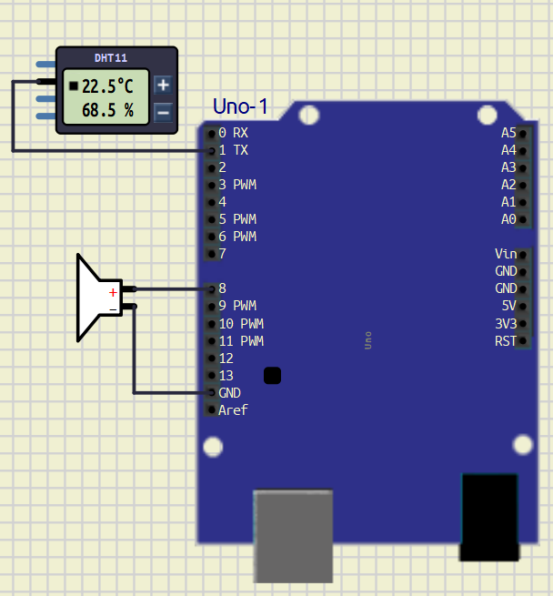
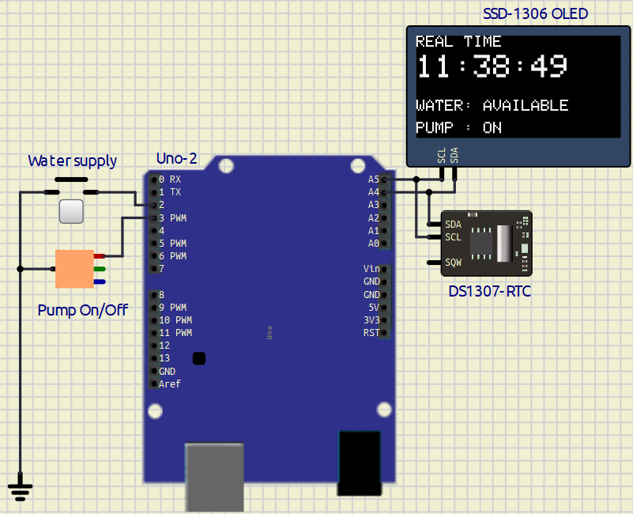
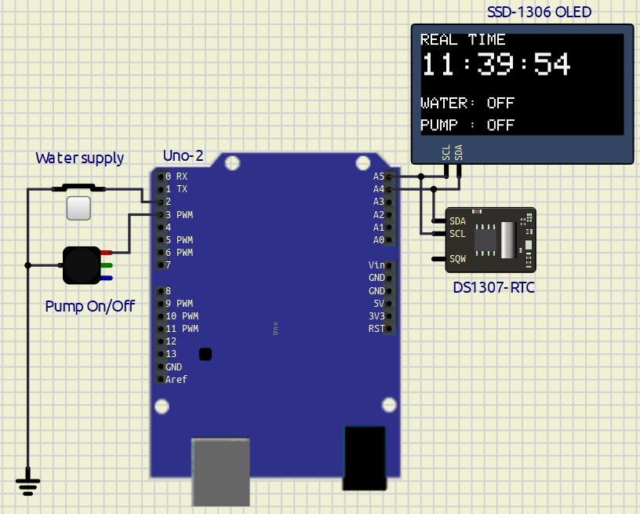

# **EXPERIMENT – 0 Introduction to Arduino**

## PROJECT NAME

**LED Flash System**

---

## PROBLEM STATEMENT

The objective of this experiment is to interface an LED with Arduino UNO and make the LED blink continuously at a fixed interval.

This experiment helps me understanding:
- Digital output pins of Arduino
- Basic Arduino programming structure
- Use of functions in Arduino
- Timing control using `delay()`

---

## COMPONENTS USED

| Component | Quantity |
|---|---|
| Arduino UNO | 1 |
| LED | 1 |
| 100Ω Resistor | 1 |
| Breadboard | 1 |
| Jumper Wires | Required |

---

## PIN CONNECTIONS

| Device | Arduino Pin |
|---|---|
| LED Positive Terminal | D12 |
| LED Negative Terminal | GND |

---

## SOFTWARE USED

- Arduino IDE
- [SimulIDE](./Exp-0/led_flash/led_flash.sim1)

---

## CIRCUIT DIAGRAM


---

## MAIN ARDUINO CODE

```cpp
#define led 12 //Led Pin 12 

void setup() {
    pinMode(led, OUTPUT);
}

void loop() {
    toggle_led();
}

void toggle_led()
{
    digitalWrite(led, HIGH);
    delay(1000);

    digitalWrite(led, LOW);
    delay(1000);
}
```

---

## WORKING PRINCIPLE

1. The LED is connected to digital pin D12 of Arduino UNO.

2. In the `setup()` function, pin D12 is configured as an output pin using `pinMode()`.

3. The `loop()` function continuously calls the `toggle_led()` function.

4. Inside the `toggle_led()` function:
   - The LED turns ON using `digitalWrite(HIGH)`
   - Arduino waits for 1 second using `delay(1000)`
   - The LED turns OFF using `digitalWrite(LOW)`
   - Arduino again waits for 1 second

5. This process repeats continuously, causing the LED to blink repeatedly.

---
## WHAT I LEARN

- Arduino UNO digital pins give approximately 5V output
- Recommended current per digital pin is 20mA
- Maximum current per digital pin is 40mA
- Typical LED operating current is around 10mA to 20mA
- LEDs should be connected using a current limiting resistor
- Basic LED interfacing with Arduino UNO
---
## CONCLUSION

The LED Blinking System using Arduino UNO was successfully implemented and tested.

The LED blinked continuously with a delay of 1 second ON and 1 second OFF. This experiment helped in understanding basic Arduino programming, digital output control, and hardware interfacing.

---

## REFERENCES

1. Arduino Official Website  
https://www.arduino.cc/

2. Arduino UNO Documentation  
https://docs.arduino.cc/hardware/uno-rev3/

3. Arduino Tutorials  
https://www.arduino.cc/en/Tutorial/HomePage

4. Arduino IDE Documentation  
https://docs.arduino.cc/software/ide/

5. SimulIDE  
https://simulide.com/


# **EXPERIMENT – 0 GO FURTHER – 1**

## **PROJECT NAME**

**7 Segment Display Interfacing with Arduino UNO**

---

## **OBJECTIVE / PROBLEM STATEMENT**

The objective of this project is to interface a common cathode 7-segment display with Arduino UNO and display numbers sequentially.

This experiment helps in understanding:
- 7-segment display interfacing
- Digital output control
- Number display logic
- Multi-pin control using Arduino

---

## **COMPONENTS USED**

| Component | Quantity |
|---|---|
| Arduino UNO | 1 |
| 7 Segment Display (Common Cathode) | 1 |
| 220Ω Resistors | 7 |
| Jumper Wires | Required |
| Breadboard | 1 |

---

## **PIN CONNECTIONS**

| 7 Segment Pin | Arduino Pin |
|---|---|
| a | D2 |
| b | D3 |
| c | D4 |
| d | D5 |
| e | D6 |
| f | D7 |
| g | D8 |

---

## **SOFTWARE USED**

- Arduino IDE
- SimulIDE

---

## **CIRCUIT DIAGRAM**
 


---

## **MAIN ARDUINO CODE**

```cpp
// 7 Segment Display with Arduino UNO
// Common Cathode Display

int a = 2;
int b = 3;
int c = 4;
int d = 5;
int e = 6;
int f = 7;
int g = 8;

void setup() {

  pinMode(a, OUTPUT);
  pinMode(b, OUTPUT);
  pinMode(c, OUTPUT);
  pinMode(d, OUTPUT);
  pinMode(e, OUTPUT);
  pinMode(f, OUTPUT);
  pinMode(g, OUTPUT);

}

void loop() {

  // Display 0
  digitalWrite(a, HIGH);
  digitalWrite(b, HIGH);
  digitalWrite(c, HIGH);
  digitalWrite(d, HIGH);
  digitalWrite(e, HIGH);
  digitalWrite(f, HIGH);
  digitalWrite(g, LOW);

  delay(1000);

  // Display 1
  digitalWrite(a, LOW);
  digitalWrite(b, HIGH);
  digitalWrite(c, HIGH);
  digitalWrite(d, LOW);
  digitalWrite(e, LOW);
  digitalWrite(f, LOW);
  digitalWrite(g, LOW);

  delay(1000);

  // Display 2
  digitalWrite(a, HIGH);
  digitalWrite(b, HIGH);
  digitalWrite(c, LOW);
  digitalWrite(d, HIGH);
  digitalWrite(e, HIGH);
  digitalWrite(f, LOW);
  digitalWrite(g, HIGH);

  delay(1000);

  // Display 3
  digitalWrite(a, HIGH);
  digitalWrite(b, HIGH);
  digitalWrite(c, HIGH);
  digitalWrite(d, HIGH);
  digitalWrite(e, LOW);
  digitalWrite(f, LOW);
  digitalWrite(g, HIGH);

  delay(1000);

}
```

---

## **WORKING PRINCIPLE**

1. The 7-segment display segments are connected to Arduino digital pins D2 to D8.

2. Each segment is controlled individually using `digitalWrite()`.

3. Depending on which segments are turned ON or OFF, different numbers are displayed.

4. The Arduino sequentially displays:
   - 0
   - 1
   - 2
   - 3

5. Each number remains visible for 1 second using `delay(1000)`.

6. The sequence repeats continuously.

---

## **WHAT I LEARN**

- Interfacing a 7-segment display with Arduino UNO
- Common cathode display working principle
- Using multiple digital output pins
- Number display logic using segments
- Arduino digital output voltage is approximately 5V
- Recommended current per pin is 20mA
- Typical LED segment current is around 10mA to 20mA

---

## **CONCLUSION**

The 7-segment display was successfully interfaced with Arduino UNO.

The display sequentially showed numbers from 0 to 3 by controlling individual segments through Arduino digital pins. This project helped in understanding display interfacing and segment control logic.

---

## **REFERENCES**

1. Arduino Official Website  
https://www.arduino.cc/

2. Arduino UNO Documentation  
https://docs.arduino.cc/hardware/uno-rev3/

3. 7 Segment Display Basics  
https://www.electronics-tutorials.ws/blog/7-segment-display-tutorial.html

4. Arduino Tutorials  
https://www.arduino.cc/en/Tutorial/HomePage 

<div style="break-after: page;"></div>

# **EXPERIMENT – 0 GO FURTHER – 2**

## PROJECT NAME

**LED Matrix Emoji Display System**

---

## OBJECTIVE / PROBLEM STATEMENT

The objective of this project is to interface an 8×8 LED matrix with Arduino UNO and display different emoji patterns.

This experiment helps in understanding:
- LED matrix interfacing
- Row and column scanning
- Pattern generation
- Multiplexing technique

---

## COMPONENTS USED

| Component | Quantity |
|---|---|
| Arduino UNO | 1 |
| 8×8 LED Matrix | 1 |
| 125Ω Resistors | 8 |
| Jumper Wires | Required |
| Breadboard | 1 |

---

## PIN CONNECTIONS

| LED Matrix | Arduino Pin |
|---|---|
| Row 1 | D1 |
| Row 2 | D2 |
| Row 3 | D3 |
| Row 4 | D4 |
| Row 5 | D5 |
| Row 6 | D6 |
| Row 7 | D7 |
| Row 8 | D8 |
| Column 1 | A5 |
| Column 2 | A4 |
| Column 3 | A3 |
| Column 4 | A2 |
| Column 5 | D9 |
| Column 6 | D10 |
| Column 7 | D11 |
| Column 8 | D12 |

---

## SOFTWARE USED

- Arduino IDE
- Proteus / SimulIDE

---

## CIRCUIT DIAGRAM


---

## MAIN ARDUINO CODE

```cpp
byte rows[8] = {1,2,3,4,5,6,7,8};
byte cols[8] = {A5,A4,A3,A2,9,10,11,12};

// Emoji Patterns
byte emoji[3][8] = {

  // Smiley Face
  {
    B00111100,
    B01000010,
    B10100101,
    B10000001,
    B10100101,
    B10011001,
    B01000010,
    B00111100
  },

  // Sad Face
  {
    B00111100,
    B01000010,
    B10100101,
    B10000001,
    B10011001,
    B10100101,
    B01000010,
    B00111100
  }
};

void setup() {

  for(int i=0; i<8; i++) {
    pinMode(rows[i], OUTPUT);
    pinMode(cols[i], OUTPUT);
  }
}

void displayEmoji(int num) {

  for(int t=0; t<250; t++) {

    for(int r=0; r<8; r++) {

      // OFF all rows
      for(int i=0; i<8; i++) {
        digitalWrite(rows[i], LOW);
      }

      // OFF all columns
      for(int i=0; i<8; i++) {
        digitalWrite(cols[i], HIGH);
      }

      // Activate current row
      digitalWrite(rows[r], HIGH);

      // Display pattern
      for(int c=0; c<8; c++) {

        if(bitRead(emoji[num][r], 7-c)) {
          digitalWrite(cols[c], LOW);
        }
      }

      delay(2);
    }
  }
}

void loop() {

  displayEmoji(0); // Smiley
  //displayEmoji(1); // Heart
  displayEmoji(2); // Sad
}
```

---

## WORKING PRINCIPLE

1. The 8×8 LED matrix is connected to Arduino UNO using row and column connections.

2. Arduino scans rows and columns rapidly using multiplexing.

3. Binary patterns are stored inside the `emoji` array.

4. The `displayEmoji()` function activates rows one by one and controls columns according to the stored pattern.

5. Different emoji patterns are displayed continuously on the LED matrix.

6. Due to fast scanning, the complete image appears continuously visible.

---

## WHAT I LEARN

- Interfacing an LED matrix with Arduino UNO
- Multiplexing technique
- Row and column scanning
- Pattern generation using binary values
- Arduino digital output voltage is approximately 5V
- Recommended current per pin is 20mA
- LED matrix LEDs require current limiting resistors

---
## CONCLUSION

The LED matrix was successfully interfaced with Arduino UNO.

Different emoji patterns were displayed by controlling rows and columns using multiplexing techniques. This project helped in understanding matrix displays and pattern generation in embedded systems.

---

## REFERENCES

1. Arduino Official Website  
https://www.arduino.cc/

2. Arduino UNO Documentation  
https://docs.arduino.cc/hardware/uno-rev3/

3. LED Matrix Basics  
https://www.electronicsforu.com/resources/learn-electronics/8x8-led-matrix-module

4. Arduino Tutorials  
https://www.arduino.cc/en/Tutorial/HomePage


<div style="break-after: page;"></div>


# **EXPERIMENT – 1 INTERFACING WITH ARDUINO**

## PROJECT NAME

**Digital Temperature Monitoring System**

---

## OBJECTIVE / PROBLEM STATEMENT

The main objective of this project is to design a smart temperature monitoring system using Arduino UNO and a DHT11 temperature sensor.

The system continuously measures room temperature and displays the live temperature value on an SSD1306 OLED display. According to the temperature value, the system automatically controls cooling and heating devices such as a fan and heater.

A push button is also provided to turn the complete system ON or OFF manually.

---

## COMPONENTS USED

| Component | Quantity |
|---|---|
| Arduino UNO | 1 |
| DHT11 Temperature Sensor | 1 |
| SSD1306 OLED Display | 1 |
| Red LED | 1 |
| Green LED | 1 |
| DC Fan / Motor | 1 |
| Heater / Bulb | 1 |
| Push Button | 1 |
| Jumper Wires | Required |

---

## PIN CONNECTIONS

| Device | Arduino Pin |
|---|---|
| DHT11 Data Pin | D2 |
| Red LED | D3 |
| Green LED | D4 |
| Push Button | D7 |
| Heater | D8 |
| Fan | D9 |
| OLED SDA | A4 |
| OLED SCL | A5 |

---

## SOFTWARE USED

- Arduino IDE
- SimulIDE

---

## CIRCUIT DIAGRAM


---

## REQUIRED LIBRARIES

```cpp
#include <Wire.h>
#include <Adafruit_GFX.h>
#include <Adafruit_SSD1306.h>
#include <DHT.h>
```

---

## MAIN ARDUINO CODE


````cpp
#include <Wire.h>
#include <Adafruit_GFX.h>
#include <Adafruit_SSD1306.h>
#include <DHT.h>

#define SCREEN_WIDTH 128
#define SCREEN_HEIGHT 64

#define DHTPIN 2
#define DHTTYPE DHT11

DHT dht(DHTPIN, DHTTYPE);

Adafruit_SSD1306 display(
  SCREEN_WIDTH,
  SCREEN_HEIGHT,
  &Wire,
  -1
);

bool systemON = false;

void setup()
{
  dht.begin();

  display.begin(SSD1306_SWITCHCAPVCC, 0x3C);

  display.clearDisplay();

  pinMode(3, OUTPUT);

  pinMode(4, OUTPUT);

  pinMode(9, OUTPUT);

  pinMode(8, OUTPUT);

  pinMode(7, INPUT_PULLUP);
}

void loop()
{
  if(digitalRead(7) == LOW)
  {
    systemON = !systemON;

    delay(300);
  }

  if(systemON)
  {
    float temp = dht.readTemperature();

    display.clearDisplay();

    display.setTextSize(2);

    display.setTextColor(WHITE);

    String text = String(temp) + " C";

    int x = (128 - (text.length() * 12)) / 2;

    int y = (64 - 16) / 2;

    display.setCursor(x, y);

    display.print(text);

    display.display();

    if(temp >= 28)
    {
      digitalWrite(3, HIGH);

      digitalWrite(4, LOW);

      digitalWrite(9, HIGH);

      digitalWrite(8, LOW);
    }
    else
    {
      digitalWrite(3, LOW);

      digitalWrite(4, HIGH);

      digitalWrite(9, LOW);

      digitalWrite(8, HIGH);
    }
  }

  else
  {
    digitalWrite(3, LOW);

    digitalWrite(4, LOW);

    digitalWrite(9, LOW);

    digitalWrite(8, LOW);

    display.clearDisplay();

    display.display();
  }

  delay(1000);
}
````
## WORKING PRINCIPLE

1. The push button is used to turn the complete system ON or OFF.

2. When the system is ON, the DHT11 sensor continuously measures room temperature.

3. The measured temperature value is displayed on the OLED screen in real time.

4. The Arduino UNO compares the measured temperature with the predefined threshold temperature value.

5. If the temperature becomes greater than or equal to 28°C:
   - Red LED turns ON
   - Fan starts running automatically
   - Heater turns OFF

6. If the temperature becomes lower than 28°C:
   - Green LED turns ON
   - Heater turns ON automatically
   - Fan turns OFF

7. The OLED display continuously updates the live temperature reading.

8. When the push button is pressed again:
   - The complete system turns OFF
   - OLED display becomes blank
   - LEDs turn OFF
   - Fan and heater stop working

---
## APPLICATIONS

- Smart room temperature control
- Automatic cooling systems
- Automatic heating systems
- Industrial temperature monitoring
- Home automation projects
- Embedded systems learning

---

## CONCLUSION

The Digital Temperature Monitoring System using Arduino UNO and DHT11 sensor was successfully implemented and tested in SimulIDE.

The system continuously monitored temperature and automatically controlled the fan and heater according to the temperature value. The OLED display successfully showed live temperature readings, and the push button provided convenient ON/OFF control of the complete system.

This project helped in understanding:
- Arduino interfacing
- Sensor interfacing
- OLED display handling
- Embedded system automation
- Temperature-based control systems

---

## REFERENCES

1. Arduino UNO Documentation  
https://docs.arduino.cc/hardware/uno-rev3/

2. DHT11 Sensor Documentation  
https://components101.com/sensors/dht11-temperature-sensor

3. Adafruit SSD1306 Library  
https://github.com/adafruit/Adafruit_SSD1306

4. Adafruit GFX Library  
https://github.com/adafruit/Adafruit-GFX-Library

5. Arduino DHT Sensor Library  
https://docs.arduino.cc/libraries/dht-sensor-library/

6. Arduino UNO Pinout  
https://deepbluembedded.com/arduino-uno-pinout/

<div style="break-after: page;"></div>

# **EXPERIMENT – 1 GO FURTHER – 1**

---

## PROJECT NAME

 **Temperature Monitoring-Emergency Alert System**

---

## OBJECTIVE / PROBLEM STATEMENT

This project monitors temperature using a DHT11 sensor and activates a buzzer when the temperature exceeds the threshold value of 50°C. The system is designed using Arduino UNO in SimulIDE.

---

## COMPONENTS USED

| Component | Quantity |
|---|---|
| Arduino UNO | 1 |
| DHT11 Temperature Sensor | 1 |
| Buzzer | 1 |
| Jumper Wires | Required |

---

## PIN CONNECTIONS

| Device | Arduino Pin |
|---|---|
| DHT11 Data Pin | D1 |
| Buzzer | D8 |
| DHT11 VCC | 5V |
| DHT11 GND | GND |

---

## SOFTWARE USED

- Arduino IDE
- SimulIDE


---


## Circuit diagram

---


## REQUIRED LIBRARY

```cpp
#include <DHT.h>
```

---

## MAIN ARDUINO CODE
[Code](/Exp-1/temp_alert_sys/temp_alert_sys.ino)

```cpp
#include <DHT.h>

#define DHTPIN 1
#define DHTTYPE DHT11
#define BUZZER 8
#define THRESHOLD 50

DHT dht(DHTPIN, DHTTYPE);

void setup()
{
    pinMode(BUZZER, OUTPUT);
    dht.begin();
}

void loop()
{
    float temp = dht.readTemperature();

    if(temp >= THRESHOLD)
    {
        digitalWrite(BUZZER, HIGH);
    }
    else
    {
        digitalWrite(BUZZER, LOW);
    }

    delay(1000);
}
```

---

## WORKING PRINCIPLE

1. DHT11 sensor continuously reads temperature.
2. Arduino UNO compares the temperature with the threshold value.
3. If temperature is greater than or equal to 50°C:
   - Buzzer turns ON.
4. If temperature is below 50°C:
   - Buzzer remains OFF.
5. The process repeats continuously.

---

## OUTPUT

- Buzzer remains OFF below 50°C.
- Buzzer turns ON at or above 50°C.
- System performs real-time temperature monitoring.
---

## CONCLUSION

The Digital Temperature Monitoring System using Arduino UNO and DHT11 sensor was successfully implemented in SimulIDE. The buzzer activated whenever the temperature crossed the threshold value of 50°C.

---
## References
 1. Arduino Project hub- With DHT11 sensor https://projecthub.arduino.cc/arcaegecengiz/using-dht11-12f621
2. DHT sensor Library - https://docs.arduino.cc/libraries/dht-sensor-library/#Releases

3. Arduino Uno board Pin Out - 
https://deepbluembedded.com/arduino-uno-pinout/


<div style="break-after: page;"></div>

# **EXPERIMENT – 1 GO FURTHER – 2**

---

## PROJECT NAME

**Weather Forecasting System with Extreme Temperature Indicator**

---

## OBJECTIVE / PROBLEM STATEMENT

This project monitors environmental temperature and humidity using a DHT11 sensor and predicts weather conditions based on temperature values.  

The system uses RGB LED indicators to show:
- Extreme Hot Weather
- Normal Weather
- Cold Weather

A DS1307 RTC module provides real-time clock information, and an SSD1306 OLED display shows:
- Current Time
- Temperature
- Humidity
- Weather Status

A push button is also used as a master power control for turning the complete system ON and OFF.

---

## COMPONENTS USED

| Component | Quantity |
|---|---|
| Arduino UNO | 1 |
| DHT11 Sensor | 1 |
| DS1307 RTC Module | 1 |
| SSD1306 OLED Display | 1 |
| RGB LED | 1 |
| Push Button | 1 |
| Resistors (100Ω) | 3 |
| Jumper Wires | Required |
| Breadboard | 1 |

---

## PIN CONNECTIONS

| Device | Arduino Pin |
|---|---|
| DHT11 Data Pin | D7 |
| Red LED | D2 |
| Green LED | D3 |
| Blue LED | D5 |
| Power Button | D8 |
| OLED SDA | A4 |
| OLED SCL | A5 |
| RTC SDA | A4 |
| RTC SCL | A5 |

---

## RGB LED CONNECTION

| RGB Pin | Connection |
|---|---|
| Red Pin | D2 through 100Ω |
| Green Pin | D3 through 100Ω |
| Blue Pin | D5 through 100Ω |
| Common Cathode | GND |

---

## SOFTWARE USED

- Arduino IDE
- SimulIDE

---

## CIRCUIT DIAGRAM


---

## REQUIRED LIBRARIES

```cpp
#include <Wire.h>
#include <RTClib.h>
#include <DHT.h>
#include <Adafruit_GFX.h>
#include <Adafruit_SSD1306.h>
```

---

## MAIN ARDUINO CODE

[Code](/Exp-7/weather_forecast_system/weather_forecast_system.ino)

```cpp
#include <Wire.h>
#include <RTClib.h>

#include <DHT.h>

#include <Adafruit_GFX.h>
#include <Adafruit_SSD1306.h>

#define SCREEN_WIDTH 128
#define SCREEN_HEIGHT 64

Adafruit_SSD1306 display(
  SCREEN_WIDTH,
  SCREEN_HEIGHT,
  &Wire,
  -1
);

RTC_DS1307 rtc;

#define DHTPIN 7
#define DHTTYPE DHT11

DHT dht(DHTPIN, DHTTYPE);

#define RED_LED      2
#define GREEN_LED    3
#define BLUE_LED     5

#define POWER_BUTTON 8

bool systemState = false;

bool lastButtonState = HIGH;

void setup()
{
  pinMode(RED_LED, OUTPUT);

  pinMode(GREEN_LED, OUTPUT);

  pinMode(BLUE_LED, OUTPUT);

  pinMode(POWER_BUTTON, INPUT_PULLUP);

  Wire.begin();

  rtc.begin();

  dht.begin();

  // rtc.adjust(DateTime(F(__DATE__), F(__TIME__)));

  if (!display.begin(SSD1306_SWITCHCAPVCC, 0x3C))
  {
    while (1);
  }

  display.clearDisplay();

  display.display();
}

void loop()
{
  bool buttonState = digitalRead(POWER_BUTTON);

  if (
      buttonState == LOW &&
      lastButtonState == HIGH
     )
  {
    delay(50);

    systemState = !systemState;

    if (systemState == true)
    {
      display.clearDisplay();

      display.setTextSize(2);

      display.setTextColor(WHITE);

      display.setCursor(10, 25);

      display.println("POWER ON");

      display.display();

      delay(1000);
    }

    else
    {
      display.clearDisplay();

      display.setTextSize(2);

      display.setTextColor(WHITE);

      display.setCursor(10, 25);

      display.println("POWER OFF");

      display.display();

      delay(1000);

      display.clearDisplay();

      display.display();
    }
  }

  lastButtonState = buttonState;

  if (systemState == false)
  {
    digitalWrite(RED_LED, LOW);

    digitalWrite(GREEN_LED, LOW);

    digitalWrite(BLUE_LED, LOW);

    return;
  }

  DateTime now = rtc.now();

  float temperature = dht.readTemperature();

  float humidity = dht.readHumidity();

  String statusText;

  if (temperature > 35)
  {
    digitalWrite(RED_LED, HIGH);

    digitalWrite(GREEN_LED, LOW);

    digitalWrite(BLUE_LED, LOW);

    statusText = "EXTREME HOT";
  }

  else if (temperature < 20)
  {
    digitalWrite(RED_LED, LOW);

    digitalWrite(GREEN_LED, LOW);

    digitalWrite(BLUE_LED, HIGH);

    statusText = "COLD";
  }

  else
  {
    digitalWrite(RED_LED, LOW);

    digitalWrite(GREEN_LED, HIGH);

    digitalWrite(BLUE_LED, LOW);

    statusText = "NORMAL";
  }

  display.clearDisplay();

  display.setTextSize(1);

  display.setTextColor(WHITE);

  display.setCursor(0, 0);

  display.println("WEATHER SYSTEM");

  display.setCursor(0, 15);

  display.print("TIME : ");

  print2digit(now.hour());

  display.print(":");

  print2digit(now.minute());

  display.print(":");

  print2digit(now.second());

  display.setCursor(0, 30);

  display.print("TEMP : ");

  display.print(temperature);

  display.println(" C");

  display.setCursor(0, 42);

  display.print("HUM  : ");

  display.print(humidity);

  display.println(" %");

  display.setCursor(0, 55);

  display.print("STATUS:");

  display.println(statusText);

  display.display();

  delay(50);
}

void print2digit(int number)
{
  if (number < 10)
  {
    display.print("0");
  }

  display.print(number);
}
```
---

## WORKING PRINCIPLE

1. The system starts with a blank OLED screen.
2. Pressing the power button:
   - Turns the system ON
   - Displays "POWER ON"
3. DHT11 sensor continuously reads:
   - Temperature
   - Humidity
4. DS1307 RTC module provides:
   - Real-time clock
5. OLED displays:
   - Time
   - Temperature
   - Humidity
   - Weather Status
6. RGB LED indicates weather        condition:
   - Red LED → Extreme Hot
   - Green LED → Normal Weather
   - Blue LED → Cold Weather
7. Pressing the power button again:
   - Displays "POWER OFF"
   - Turns OFF all LEDs
   - OLED returns to black screen
---
## TEMPERATURE INDICATOR LOGIC

| Temperature | LED Status | Weather |
|---|---|---|
| > 35°C | Red LED ON | Extreme Hot |
| 20°C – 35°C | Green LED ON | Normal |
| < 20°C | Blue LED ON | Cold |

---
## OUTPUT

### **System - COLD ( Temp < 20 )**


### **System - Normal ( Temp > 20 & < 36 )**


### **System - Extream Hot ( Temp > 35 )**


---

## APPLICATIONS

- Smart weather stations
- Environmental monitoring
- Temperature warning systems
- Industrial monitoring

---

## CONCLUSION

The Weather Forecasting System using Arduino UNO, DHT11 sensor, DS1307 RTC module, SSD1306 OLED display, RGB LED, and push-button control was successfully implemented in SimulIDE.

The system correctly monitors weather conditions, displays real-time environmental information, and visually indicates temperature conditions using RGB LEDs.

During this experiment, I learned:
- Sensor, OLED & RTC interfacing
- RGB LED control
- Push-button logic

---

## REFERENCES

1. Arduino UNO Documentation  
https://docs.arduino.cc/hardware/uno-rev3/

2. DHT11 Sensor Documentation  
https://components101.com/sensors/dht11-temperature-sensor

3. DS1307 RTC Datasheet  
https://datasheets.maximintegrated.com/en/ds/DS1307.pdf

4. Adafruit SSD1306 Library  
https://github.com/adafruit/Adafruit_SSD1306

5. Adafruit GFX Library  
https://github.com/adafruit/Adafruit-GFX-Library

6. RTClib Documentation  
https://github.com/adafruit/RTClib

---

<div style="break-after: page;"></div>

# EXPERIMENT– 2 Calculator Design 

---

## PROJECT NAME

Simple Calculator Using Arduino UNO, 4x4 Keypad and SSD1306 OLED Display

---

## OBJECTIVE / PROBLEM STATEMENT

This project implements a simple calculator using Arduino UNO, a 4x4 keypad, and an SSD1306 OLED display. The calculator performs basic arithmetic operations such as addition, subtraction, multiplication, and division. The result is displayed on the OLED screen.

---

## COMPONENTS USED

| Component | Quantity |
|---|---|
| Arduino UNO | 1 |
| 4x4 Keypad | 1 |
| SSD1306 OLED Display | 1 |
| Jumper Wires | Required |
| Breadboard | 1 |

---

## PIN CONNECTIONS

### 4x4 KEYPAD CONNECTIONS

| Keypad Pin | Arduino Pin |
|---|---|
| R1 | D1 |
| R2 | D2 |
| R3 | D3 |
| R4 | D4 |
| C1 | D5 |
| C2 | D6 |
| C3 | D7 |
| C4 | D8 |

### Symbols mapped operators
|Symbol| Operation |
|---|---|
| A | + |
| B | - |
| C | * |
| D | / |
| # | AC| 
---

### SSD1306 OLED DISPLAY CONNECTIONS

| OLED Pin | Arduino Pin |
|---|---|
| VCC | 5V |
| GND | GND|
| SDA | A4 | 
| SCL | A5 |

---

## SOFTWARE USED

- Arduino IDE
- SimulIDE

---

## CIRCUIT DIAGRAM

<image src='./Exp-2/Calculator/Start.png' width='200'>

### Example:
<image src='./Exp-2/Calculator/Operation.png' width='200'>

<image src='./Exp-2/Calculator/result.png' width='200'>
---


## REQUIRED LIBRARIES

```cpp
#include <Wire.h>
#include <Adafruit_GFX.h>
#include <Adafruit_SSD1306.h>
#include <Keypad.h>
```

---

## MAIN ARDUINO CODE

### Code With Comments ---> [Click here](/Exp-2/Calculator/file.ino)

```cpp
#include <Wire.h>
#include <Adafruit_GFX.h>
#include <Adafruit_SSD1306.h>
#include <Keypad.h>

#define SCREEN_WIDTH 128
#define SCREEN_HEIGHT 64

Adafruit_SSD1306 display(SCREEN_WIDTH, SCREEN_HEIGHT, &Wire, -1);

const byte ROWS = 4;
const byte COLS = 4;

char keys[ROWS][COLS] = {
  {'1', '2', '3', '+'},
  {'4', '5', '6', '-'},
  {'7', '8', '9', '*'},
  {'#', '0', '=', '/'}
};

byte rowPins[ROWS] = {1, 2, 3, 4};
byte colPins[COLS] = {5, 6, 7, 8};

Keypad keypad = Keypad(makeKeymap(keys),
                       rowPins,
                       colPins,
                       ROWS,
                       COLS);

String num1 = "";
String num2 = "";

char op;

float result;

bool operatorPressed = false;

String expression = "";

void setup()
{
    display.begin(SSD1306_SWITCHCAPVCC, 0x3C);

    display.clearDisplay();

    display.setTextSize(1);

    display.setCursor(0, 0);
    display.println("Simple Calculator");

    display.setCursor(0, 20);
    display.println("Can Perform");

    display.setCursor(0, 40);
    display.println("(+,-,*,/)");

    display.display();

    delay(2000);

    display.clearDisplay();
    display.display();
}

void loop()
{
    char key = keypad.getKey();

    if(key)
    {
        // CLEAR ALL
        if(key == '#')
        {
            num1 = "";
            num2 = "";
            expression = "";

            operatorPressed = false;

            result = 0;

            display.clearDisplay();
            display.display();
        }

        // NUMBER INPUT
        else if(isDigit(key))
        {
            if(!operatorPressed)
            {
                num1 += key;
            }
            else
            {
                num2 += key;
            }

            expression += key;

            updateDisplay(expression);
        }

        // OPERATOR INPUT
        else if(key == '+' || key == '-' ||
                key == '*' || key == '/')
        {
            if(!operatorPressed && num1 != "")
            {
                op = key;

                operatorPressed = true;

                expression += key;

                updateDisplay(expression);
            }
        }

        // RESULT
        else if(key == '=')
        {
            float n1 = num1.toFloat();
            float n2 = num2.toFloat();

            switch(op)
            {
                case '+':
                    result = n1 + n2;
                    break;

                case '-':
                    result = n1 - n2;
                    break;

                case '*':
                    result = n1 * n2;
                    break;

                case '/':

                    if(n2 != 0)
                    {
                        result = n1 / n2;
                    }
                    else
                    {
                        display.clearDisplay();

                        display.setTextSize(2);

                        display.setCursor(0, 20);

                        display.println("ERROR");

                        display.display();

                        delay(2000);

                        return;
                    }

                    break;
            }

            expression = "Result= " + String(result);

            updateDisplay(expression);

            num1 = String(result);

            num2 = "";

            operatorPressed = false;

            expression = String(result);
        }
    }
}

void updateDisplay(String text)
{
    display.clearDisplay();

    display.setTextSize(2);

    display.setCursor(0, 20);

    display.println(text);

    display.display();
}
```

---

## WORKING PRINCIPLE

1. The 4x4 keypad is used to enter numbers and operators.
2. Arduino UNO continuously scans the keypad.
3. Entered values are stored as operands.
4. The selected operator determines the operation to be performed.
5. When '=' is pressed:
   - Arduino performs the calculation.
   - Result is displayed on the SSD1306 OLED display.
6. '#' key clears all previous inputs.
7. The process repeats continuously.

---

## OUTPUT

### Startup Screen

```text
Simple Calculator
```

---

### Example Calculation

```text
5+3

Result= 8
```

---

## CONCLUSION

The Simple Calculator using Arduino UNO, 4x4 Keypad, and SSD1306 OLED Display was successfully implemented and tested. The system successfully performs basic arithmetic operations and displays the result on the OLED screen.
During the experiment I faces problem in mapping those keys and assign them their values. I overcome it by the open source resources given in web and arduino forum

---

## REFERENCES

1. Arduino Keypad Library Documentation  
https://www.arduino.cc/reference/en/libraries/keypad/

2. SSD1306 OLED Display Library  
https://github.com/adafruit/Adafruit_SSD1306

3. Arduino UNO Official Documentation  
https://docs.arduino.cc/hardware/uno-rev3/

4. Adafruit GFX Graphics Library  
https://github.com/adafruit/Adafruit-GFX-Library

5. 4×4 Keypad Arduino Code, Pinout & Interfacing Complete Guide
https://robosans.com/learn/embedded/arduino/4x4-keypad-arduino-code-pinout-interfacing-lcd/

<div style="break-after: page;"></div>

# **EXPERIMENT – 2 GO FURTHER – 1**

## PROJECT NAME

**BODMAS Method Based Calculator**

---

## OBJECTIVE

To design a calculator using Arduino UNO, OLED display, and keypad that performs arithmetic calculations according to the BODMAS rule.

---

## COMPONENTS USED

| Component | Quantity |
|---|---|
| Arduino UNO | 1 |
| SSD1306 OLED Display | 1 |
| 5×4 Matrix Keypad | 1 |
| Breadboard | 1 |
| Jumper Wires | Required |

---

## PIN CONNECTIONS

### OLED

| OLED Pin | Arduino Pin |
|---|---|
| SDA | A4 |
| SCL | A5 |

---

### Keypad

| Keypad Pin | Arduino Pin |
|---|---|
| R1–R5 | D2–D6 |
| C1–C4 | D7–D10 |

---

## KEYPAD FUNCTIONS

| Key | Function |
|---|---|
| A | + |
| S | - |
| M | * |
| D | / |
| = | Calculate |
| # | Clear |
| B | Backspace |
| H | History |

---

## SOFTWARE USED

- Arduino IDE
- SimulIDE

---

## CIRCUIT DIAGRAM

<image src='./exp-2/calc_adv/circuit1.png' width='205'>
<image src='./exp-2/calc_adv/circuit2.png' width='200'>


---

## MAIN ARDUINO CODE

```cpp
//======================================================
// BODMAS Calculator using Arduino UNO
// OLED Display + 5x4 Keypad
//
// Features:
// - Addition
// - Subtraction
// - Multiplication
// - Division
// - Brackets
// - History
// - Backspace
// - BODMAS Rule
//======================================================


//==================== LIBRARIES ====================

// I2C Communication Library
#include <Wire.h>

// OLED Graphics Library
#include <Adafruit_GFX.h>

// OLED SSD1306 Library
#include <Adafruit_SSD1306.h>

// Matrix Keypad Library
#include <Keypad.h>


//==================== OLED SETTINGS ====================

// OLED width
#define SCREEN_WIDTH 128

// OLED height
#define SCREEN_HEIGHT 64

// Create OLED display object
Adafruit_SSD1306 display(SCREEN_WIDTH, SCREEN_HEIGHT, &Wire, -1);


//==================== KEYPAD SETTINGS ====================

// Number of rows in keypad
const byte ROWS = 5;

// Number of columns in keypad
const byte COLS = 4;


// Keypad button layout
char keys[ROWS][COLS] = {

  {'1','2','3','A'},
  {'4','5','6','S'},
  {'7','8','9','M'},
  {'0','=','#','D'},
  {'(',')','H','B'}
};


// Arduino pins connected to keypad rows
byte rowPins[ROWS] = {2,3,4,5,6};

// Arduino pins connected to keypad columns
byte colPins[COLS] = {7,8,9,10};


// Create keypad object
Keypad keypad = Keypad(makeKeymap(keys), rowPins, colPins, ROWS, COLS);


//==================== VARIABLES ====================

// Stores current mathematical expression
String expression = "";

// Pointer used by parser
const char* expr;


// Stores last 5 calculations
String history[5];

// Current history index
int historyIndex = 0;


//==================== OLED DISPLAY FUNCTION ====================

// Function to refresh OLED screen
void refreshDisplay() {

  // Clear OLED screen
  display.clearDisplay();

  // Set text size
  display.setTextSize(1);

  // Set text color
  display.setTextColor(SSD1306_WHITE);

  // Title
  display.setCursor(0,0);
  display.print("BODMAS CALC");

  // Expression display position
  display.setCursor(0,20);

  // Display current expression
  display.print(expression);

  // Small delay for stable Proteus simulation
  delay(50);

  // Show everything on OLED
  display.display();
}


//==================== PARSER FUNCTIONS ====================

// Skip blank spaces
void skipSpaces() {

  while(*expr == ' ')
    expr++;
}


// Forward declaration
double parseExpression();


//==================== NUMBER PARSER ====================

// Reads numbers from expression
double parseNumber() {

  double number = 0;

  // Continue while digit found
  while(isdigit(*expr)) {

    // Build number digit by digit
    number = number * 10 + (*expr - '0');

    expr++;
  }

  return number;
}


//==================== FACTOR PARSER ====================

// Handles brackets
double parseFactor() {

  // Ignore spaces
  skipSpaces();

  // Check for opening bracket
  if(*expr == '(') {

    // Move to next character
    expr++;

    // Solve expression inside bracket
    double result = parseExpression();

    // Skip closing bracket
    if(*expr == ')')
      expr++;

    return result;
  }

  // Otherwise parse normal number
  return parseNumber();
}


//==================== TERM PARSER ====================

// Handles multiplication and division
double parseTerm() {

  // Read first factor
  double result = parseFactor();

  while(true) {

    skipSpaces();

    // Multiplication
    if(*expr == '*') {

      expr++;

      result *= parseFactor();
    }

    // Division
    else if(*expr == '/') {

      expr++;

      result /= parseFactor();
    }

    else {
      break;
    }
  }

  return result;
}


//==================== EXPRESSION PARSER ====================

// Handles addition and subtraction
double parseExpression() {

  // Read first term
  double result = parseTerm();

  while(true) {

    skipSpaces();

    // Addition
    if(*expr == '+') {

      expr++;

      result += parseTerm();
    }

    // Subtraction
    else if(*expr == '-') {

      expr++;

      result -= parseTerm();
    }

    else {
      break;
    }
  }

  return result;
}


//==================== EVALUATE FUNCTION ====================

// Evaluates full mathematical expression
double evaluate(String s) {

  // Convert String to character pointer
  expr = s.c_str();

  // Start parsing expression
  return parseExpression();
}


//==================== SETUP ====================

void setup() {

  // Start serial monitor
  Serial.begin(9600);

  // Initialize OLED
  display.begin(SSD1306_SWITCHCAPVCC, 0x3C);

  // Clear OLED
  display.clearDisplay();

  // Text size
  display.setTextSize(1);

  // Text color
  display.setTextColor(SSD1306_WHITE);

  // Cursor position
  display.setCursor(0,20);

  // Startup message
  display.print("READY");

  // Show message
  display.display();

  // Wait 2 seconds
  delay(2000);

  // Show empty calculator screen
  refreshDisplay();
}


//==================== MAIN LOOP ====================

void loop() {

  // Read keypad button
  char key = keypad.getKey();

  // If any key pressed
  if(key) {

    // Print pressed key on serial monitor
    Serial.print("Key: ");
    Serial.println(key);


    //================ CALCULATE =================

    // If "=" pressed
    if(key == '=') {

      // Evaluate expression
      double result = evaluate(expression);

      // Save calculation in history
      history[historyIndex] =
      expression + "=" + String(result);

      // Move to next history slot
      historyIndex++;

      // Reset history index
      if(historyIndex >= 5) {

        historyIndex = 0;
      }

      // Replace expression with result
      expression = String(result);

      // Update OLED
      refreshDisplay();
    }


    //================ CLEAR SCREEN =================

    // If "#" pressed
    else if(key == '#') {

      // Clear expression
      expression = "";

      // Refresh OLED
      refreshDisplay();
    }


    //================ BACKSPACE =================

    // If "B" pressed
    else if(key == 'B') {

      // Remove last character
      if(expression.length() > 0) {

        expression.remove(expression.length()-1);
      }

      // Refresh OLED
      refreshDisplay();
    }


    //================ HISTORY =================

    // If "H" pressed
    else if(key == 'H') {

      // Clear OLED
      display.clearDisplay();

      // OLED settings
      display.setTextSize(1);
      display.setTextColor(SSD1306_WHITE);

      // Title
      display.setCursor(0,0);
      display.print("HISTORY");

      int y = 12;

      // Show saved history
      for(int i=0; i<5; i++) {

        if(history[i] != "") {

          display.setCursor(0,y);

          display.print(history[i]);

          y += 10;
        }
      }

      // Show on OLED
      display.display();

      // Wait 4 seconds
      delay(4000);

      // Return to calculator screen
      refreshDisplay();
    }


    //================ NORMAL INPUT =================

    else {

      // Convert keypad symbols

      if(key == 'A')
        expression += '+';

      else if(key == 'S')
        expression += '-';

      else if(key == 'M')
        expression += '*';

      else if(key == 'D')
        expression += '/';

      // Add normal characters
      else
        expression += key;

      // Refresh OLED
      refreshDisplay();
    }
  }
}
```

---

## WORKING PRINCIPLE

1. User enters expression using keypad.
2. Arduino receives keypad input.
3. OLED displays the expression.
4. On pressing `=`, Arduino evaluates the expression using BODMAS rule.
5. Result is displayed on OLED.
6. Previous calculations are stored in history.

---

## OUTPUT / RESULT

### Example

Input:

```text
(8+2)*5-20/4
```

Output:

```text
45
```

The calculator successfully performed calculations according to the BODMAS rule.
---

## CONCLUSION

The BODMAS calculator using Arduino UNO was successfully implemented. The calculator correctly evaluated mathematical expressions and displayed the results on the OLED display.

---

## REFERENCES

1. https://www.arduino.cc/

2. https://docs.arduino.cc/hardware/uno-rev3/

3. https://github.com/adafruit/Adafruit_SSD1306

4. https://playground.arduino.cc/Code/Keypad/

5. https://www.circuitbasics.com/how-to-set-up-a-keypad-on-an-arduino/

<div style="break-after: page;"></div>

# EXPERIMENT – 2 GO FURTHER – 2

## Objective

Digital Password Lock System using Arduino UNO, OLED Display, Keypad, LEDs, and Buzzer

---

## Problem Statement

To design and implement a Digital Password Lock System using Arduino UNO that allows a user to create a 4-character password, authenticate access using the password, provide visual and audio feedback for successful and failed login attempts, and support secure password reset functionality.

---

## Components Required

| Sl. No. | Component | Quantity |
|----------|-----------|----------|
| 1 | Arduino UNO | 1 |
| 2 | SSD1306 OLED Display (I2C) | 1 |
| 3 | 4×5 Matrix Keypad | 1 |
| 4 | Red LED | 1 |
| 5 | Green/Blue LED | 1 |
| 6 | Buzzer | 1 |
| 7 | Breadboard | 1 |
| 8 | Connecting Wires | As Required |
| 9 | USB Cable | 1 |

---

## Circuit Diagram

<image src='./exp-2/digi_lock/circuit.png' width='300'>

---

## Connections

### OLED Display

| OLED Pin | Arduino UNO |
|-----------|------------|
| VCC | 5V |
| GND | GND |
| SDA | A4 |
| SCL | A5 |

### Keypad Connections

| Keypad Pin | Arduino Pin |
|------------|------------|
| R1 | D2 |
| R2 | D3 |
| R3 | D4 |
| R4 | D5 |
| R5 | D6 |
| C1 | D7 |
| C2 | D8 |
| C3 | D9 |
| C4 | D10 |

### LED and Buzzer Connections

| Component | Arduino Pin |
|------------|------------|
| Buzzer | D11 |
| Green LED | D12 |
| Red LED | D13 |

---

## Code
```cpp
#include <Wire.h>
#include <Adafruit_GFX.h>
#include <Adafruit_SSD1306.h>
#include <Keypad.h>

// ================= OLED =================
#define SCREEN_WIDTH 128
#define SCREEN_HEIGHT 64

Adafruit_SSD1306 display(SCREEN_WIDTH, SCREEN_HEIGHT, &Wire, -1);

// ================= PINS =================
#define BUZZER    11
#define BLUE_LED  12
#define RED_LED   13

// ================= KEYPAD =================
const byte ROWS = 5;
const byte COLS = 4;

char keys[ROWS][COLS] = {
  {'1', '2', '3', 'A'},
  {'4', '5', '6', 'B'},
  {'7', '8', '9', 'C'},
  {'R', '0', 'X', 'D'},
  {'*', '@', '$', 'E'}
};

byte rowPins[ROWS] = {2, 3, 4, 5, 6};
byte colPins[COLS] = {7, 8, 9, 10};

Keypad keypad = Keypad(makeKeymap(keys), rowPins, colPins, ROWS, COLS);

// ================= VARIABLES =================
String adminPassword = "";
int attemptsLeft = 3;

// =====================================================

void showMessage(String line1, String line2 = "") {

  display.clearDisplay();

  display.setTextSize(1);
  display.setTextColor(WHITE);

  display.setCursor(0, 10);
  display.println(line1);

  display.setCursor(0, 30);
  display.println(line2);

  display.display();
}

// =====================================================

bool isValidPassword(String pass) {

  // Only 4 character password allowed

  if (pass.length() != 4)
    return false;

  return true;
}

// =====================================================

String readPassword() {

  String pass = "";

  while (pass.length() < 4) {

    char key = keypad.getKey();

    if (key) {

      tone(BUZZER, 1500, 80);

      pass += key;

      display.clearDisplay();

      display.setTextSize(1);
      display.setTextColor(WHITE);

      display.setCursor(0, 10);
      display.print("ENTER PASSWORD");

      display.setCursor(0, 30);

      for (int i = 0; i < pass.length(); i++) {
        display.print("*");
      }

      display.display();
    }
  }

  delay(500);

  return pass;
}

// =====================================================

void accessGranted() {

  digitalWrite(BLUE_LED, HIGH);

  tone(BUZZER, 2000, 300);

  showMessage("ACCESS GRANTED");

  delay(3000);

  digitalWrite(BLUE_LED, LOW);
}

// =====================================================

void accessDenied() {

  digitalWrite(RED_LED, HIGH);

  tone(BUZZER, 500, 500);

  showMessage(
    "WRONG PASSWORD",
    "Attempts Left: " + String(attemptsLeft)
  );

  delay(2000);

  digitalWrite(RED_LED, LOW);
}

// =====================================================

void alarmMode() {

  showMessage("SYSTEM LOCKED", "ALARM ACTIVE");

  while (1) {

    digitalWrite(RED_LED, HIGH);
    tone(BUZZER, 700);

    delay(300);

    digitalWrite(RED_LED, LOW);
    noTone(BUZZER);

    delay(300);
  }
}

// =====================================================

void createPassword() {

  while (1) {

    showMessage(
      "CREATE PASSWORD",
      "Enter 4 Characters"
    );

    String newPass = readPassword();

    if (isValidPassword(newPass)) {

      adminPassword = newPass;

      tone(BUZZER, 2000, 300);

      showMessage("PASSWORD SAVED");

      delay(2000);

      break;
    }

    else {

      tone(BUZZER, 400, 1000);

      showMessage("INVALID PASSWORD");

      delay(2000);
    }
  }
}

// =====================================================

void resetPassword() {

  showMessage("RESET MODE", "Enter Old Pass");

  String oldPass = readPassword();

  // Correct old password
  if (oldPass == adminPassword) {

    tone(BUZZER, 2000, 300);

    showMessage("CORRECT", "Set New Password");

    delay(2000);

    while (1) {

      String newPass = readPassword();

      if (isValidPassword(newPass)) {

        adminPassword = newPass;

        tone(BUZZER, 2000, 500);

        showMessage("PASSWORD RESET");

        delay(2000);

        return;
      }

      else {

        tone(BUZZER, 400, 1000);

        showMessage("INVALID PASSWORD");

        delay(2000);
      }
    }
  }

  // Wrong old password
  else {

    tone(BUZZER, 300, 1000);

    showMessage("WRONG OLD PASS");

    delay(2000);
  }
}

// =====================================================

void setup() {

  pinMode(BUZZER, OUTPUT);

  pinMode(BLUE_LED, OUTPUT);
  pinMode(RED_LED, OUTPUT);

  Wire.begin();

  display.begin(SSD1306_SWITCHCAPVCC, 0x3C);

  display.clearDisplay();
  display.display();

  // Create admin password
  createPassword();
}

// =====================================================

void loop() {

  showMessage(
    "ENTER PASSWORD",
    "Attempts Left: " + String(attemptsLeft)
  );

  String enteredPassword = "";

  while (enteredPassword.length() < 4) {

    char key = keypad.getKey();

    if (key) {

      // Reset password mode
      if (key == 'R') {

        resetPassword();

        return;
      }

      tone(BUZZER, 1500, 80);

      enteredPassword += key;

      display.clearDisplay();

      display.setTextSize(1);
      display.setTextColor(WHITE);

      display.setCursor(0, 10);
      display.print("ENTER PASSWORD");

      display.setCursor(0, 30);

      for (int i = 0; i < enteredPassword.length(); i++) {
        display.print("*");
      }

      display.display();
    }
  }

  // ================= CHECK PASSWORD =================

  if (enteredPassword == adminPassword) {

    attemptsLeft = 3;

    accessGranted();
  }

  else {

    attemptsLeft--;

    accessDenied();

    if (attemptsLeft <= 0) {

      alarmMode();
    }
  }
}       

```


---

## Output

### System Startup

OLED Display:

```
SET ADMIN PASS
Enter 4 Characters
```

### Password Saved

OLED Display:

```
PASSWORD SAVED
System Ready
```

### User Login

OLED Display:

```
ENTER PASSWORD
Unlock The System
```

### Correct Password

OLED Display:

```
ACCESS GRANTED

```

- Green LED turns ON.
- Buzzer beeps.

### Wrong Password

OLED Display:

```
ACCESS DENIED
LEFT: 2
```

- Red LED turns ON.
- Remaining attempts decrease.

### Alarm Mode

OLED Display:

```
SYSTEM LOCKED
PRESS R RESET
```

- Red LED blinks continuously.
- Buzzer sounds continuously.

### Password Reset

OLED Display:

```
RESET PASSWORD
Enter Old Pass
```

After successful verification:

```
CORRECT PASSWORD
Set New Pass
```

---

## Problems Faced

1. OLED display address mismatch (0x3C / 0x3D).
2. Incorrect SDA and SCL wiring.
3. Keypad row and column mapping errors.
4. Undefined LED pin names during coding.
5. OLED text overflow due to long messages.
6. Alarm mode creating an infinite loop.
7. Debugging password reset functionality.
8. Ensuring proper synchronization between keypad input and OLED display updates.

---

## Conclusion

The Digital Password Lock System was successfully implemented using Arduino UNO. The system allows secure password-based access control using a keypad and OLED display. Visual and audio feedback improve user interaction, while the three-attempt security mechanism and alarm mode enhance system security. The password reset feature further increases usability and flexibility. This experiment demonstrates practical applications of embedded systems in electronic security and access control.

## References

1. SSD1306 OLED Display Datasheet
   https://cdn-shop.adafruit.com/datasheets/SSD1306.pdf

2. Matrix Keypad Working Principle
   https://www.electronicsforu.com/technology-trends/learn-electronics/keypad-interfacing-arduino


3. I2C Communication Protocol Overview
   https://lastminuteengineers.com/i2c-lcd-arduino-tutorial/

4. Password-Based Access Control Systems
   https://circuitdigest.com/microcontroller-projects/password-based-door-lock-system-using-arduino

5. Matrix Keypad Scanning Technique
   https://www.geeksforgeeks.org/keypad-interfacing-with-arduino/

6. Buzzer and Alarm Circuit Concepts
   https://components101.com/modules/buzzer-module

<div style="break-after: page;"></div>

# **EXPERIMENT – 03**

## **PROJECT NAME**

8-Bit Arduino Function Generator using DAC and Op-Amp

---

## **OBJECTIVE / PROBLEM STATEMENT**

This experiment helps in understanding waveform generation using Arduino UNO. The project generates sine, square, and triangle waves using an 8-bit DAC system with op-amp buffering and RC filtering. The experiment demonstrates concepts of Direct Digital Synthesis (DDS), Digital-to-Analog Conversion (DAC), waveform sampling, frequency control, amplitude control, and OLED interfacing.

---

## **COMPONENTS USED**

| Component | Quantity |
|---|---|
| Arduino UNO | 1 |
| 8-Bit DAC / R-2R DAC | 1 |
| SSD1306 OLED Display | 1 |
| Op-Amp | 1 |
| 10k Potentiometer | 2 |
| Push Switch | 4 |
| Resistors | Multiple |
| Capacitor | 1 |
| Oscilloscope | 1 |

---

## **PIN CONNECTIONS**

| Device | Arduino Pin |
|---|---|
| DAC D0 | D0 |
| DAC D1 | D1 |
| DAC D2 | D2 |
| DAC D3 | D3 |
| DAC D4 | D4 |
| DAC D5 | D5 |
| DAC D6 | D6 |
| DAC D7 | D7 |
| Power Switch | D8 |
| Sine Wave Switch | D9 |
| Square Wave Switch | D10 |
| Triangle Wave Switch | D11 |
| Frequency Potentiometer | A0 |
| Amplitude Potentiometer | A1 |
| OLED SDA | A4 |
| OLED SCL | A5 |

---

## **SOFTWARE USED**

- Arduino IDE
- SimulIDE


<div style="break-after: page;"></div>

---
## **CIRCUIT DIAGRAM**


---

## **MAIN ARDUINO CODE**

```cpp
/*
Function Generator Using UNO Board (Op-Amp + DAC  8 bit)
*/

#include <Wire.h>
#include <Adafruit_GFX.h>
#include <Adafruit_SSD1306.h>
#include <math.h>


// ======================================================
// OLED SETTINGS
// ======================================================

#define SCREEN_WIDTH 128
#define SCREEN_HEIGHT 64
#define OLED_RESET -1
#define OLED_ADDR 0x3C //OLED I2C working address

Adafruit_SSD1306 display(SCREEN_WIDTH, SCREEN_HEIGHT, &Wire, OLED_RESET);


// ======================================================
// PIN DEFINITIONS
// ======================================================

#define FREQ_POT     A0  //frequency potentiometer connected to A0
#define AMP_POT      A1 // Amplitude potentiometer connected to A1

#define POWER_SW     8  //System Power Botton

#define SINE_SW      9  //sine wave generate
#define SQUARE_SW    10 //square wave generate
#define TRI_SW       11 //Traingular wave generate


// ======================================================
// VARIABLES
// ======================================================

uint8_t sineTable[256]; //formation of sine table

int freqValue;
int ampValue;

int freqDelay;

uint8_t ampScaled;


// ======================================================
// SETUP
// ======================================================

void setup()
{
  // ----------------------------------------------------
  // D0-D7 AS OUTPUT
  // ----------------------------------------------------

  DDRD = 0xFF;//

  PORTD = 0;


  // ----------------------------------------------------
  // SWITCHES
  // ----------------------------------------------------

  pinMode(POWER_SW, INPUT_PULLUP); //Assign Function to all switchs as per ther role

  pinMode(SINE_SW, INPUT_PULLUP);

  pinMode(SQUARE_SW, INPUT_PULLUP);

  pinMode(TRI_SW, INPUT_PULLUP);


  // ----------------------------------------------------
  // OLED START (Initialising Display)
  // ----------------------------------------------------

  display.begin(SSD1306_SWITCHCAPVCC, OLED_ADDR);

  display.clearDisplay(); //clear display

  display.setTextSize(1); //text size set

  display.setTextColor(WHITE); //text colour set

  display.setCursor(0,0); // Set initial coordinnate for displaying text

  display.println("FUNCTION GENERATOR"); //Printing Function Generator

  display.display(); //update display 

  delay(1000); //delay of 1s


  // ----------------------------------------------------
  // BUILD 256 SAMPLE SINE TABLE
  // ----------------------------------------------------

  for(int i=0; i<256; i++)
  {
    float angle;

    angle = (2.0 * PI * i) / 256.0;

    sineTable[i] = (uint8_t)(127.5 + 127.5 * sin(angle));
  }
}


// ======================================================
// MAIN LOOP
// ======================================================

void loop()
{

  // ====================================================
  // POWER SWITCH
  // ====================================================

  if(digitalRead(POWER_SW) == HIGH)
  {
    PORTD = 0;
    display.clearDisplay();

    display.setTextSize(2);

    display.setTextColor(WHITE);

    // "SYSTEM" centered
    display.setCursor(22,10);
    display.println("SYSTEM");

    // "OFF" centered
    display.setCursor(40,35);
    display.println("OFF");

    display.display();
    return;
  }


  // ====================================================
  // READ POTS
  // ====================================================

  freqValue = analogRead(FREQ_POT);

  ampValue  = analogRead(AMP_POT);


  // ====================================================
  // FREQUENCY CONTROL
  // ====================================================

  /*
    smaller delay = higher frequency
  */

  freqDelay = map(freqValue,0,1023,5000,60);
  
  // ====================================================
  // AMPLITUDE CONTROL
  // ====================================================

  ampScaled = map(ampValue,0,1023,0,255);


  // ====================================================
  // WAVEFORM SELECTION
  // ====================================================

  if(digitalRead(SINE_SW) == LOW)
  {
    generateSine();
  }

  else if(digitalRead(SQUARE_SW) == LOW)
  {
    generateSquare();
  }

  else if(digitalRead(TRI_SW) == LOW)
  {
    generateTriangle();
  }

  else
  {
    PORTD = 0;
  }


  // ====================================================
  // OLED UPDATE
  // ====================================================

  updateDisplay();
}


// ======================================================
// AMPLITUDE SCALE FUNCTION
// ======================================================

uint8_t scaleAmplitude(uint8_t value)
{
  return ((unsigned int)value * ampScaled) / 255;
}


// ======================================================
// SINE WAVE
// ======================================================

void generateSine()
{
  for(int i=0; i<256; i++)
  {
    PORTD = scaleAmplitude(sineTable[i]);

    delayMicroseconds(freqDelay);
  }
}


// ======================================================
// TRIANGLE WAVE
// ======================================================

void generateTriangle()
{
  for(int i=0; i<256; i++)
  {
    PORTD = scaleAmplitude(i);

    delayMicroseconds(freqDelay);
  }

  for(int i=255; i>=0; i--)
  {
    PORTD = scaleAmplitude(i);

    delayMicroseconds(freqDelay);
  }
}


// ======================================================
// SQUARE WAVE - FIXED VERSION
// ======================================================

void generateSquare()
{
  uint8_t highLevel;

  highLevel = scaleAmplitude(255);

  // FIXED: High level first, then low level
  PORTD = highLevel;

  delayMicroseconds(freqDelay * 128);

  PORTD = 0;

  delayMicroseconds(freqDelay * 128);
}


// ======================================================
// OLED DISPLAY
// ======================================================

void updateDisplay()
{
  static unsigned long lastUpdate = 0;

  if(millis() - lastUpdate < 150)
  return;

  lastUpdate = millis();


  display.clearDisplay();

  display.setTextSize(1);

  display.setCursor(0,0);

  display.println("8-BIT FUNCTION GEN");


  display.setCursor(0,18);

  display.print("FREQ : ");

  display.println(freqValue);


  display.setCursor(0,32);

  display.print("AMP  : ");

  display.println(ampValue);


  display.setCursor(0,48);

  display.print("WAVE : ");


  if(digitalRead(SINE_SW) == LOW)
  {
    display.println("SINE");
  }

  else if(digitalRead(SQUARE_SW) == LOW)
  {
    display.println("SQUARE");
  }

  else if(digitalRead(TRI_SW) == LOW)
  {
    display.println("TRIANGLE");
  }

  else
  {
    display.println("NONE");
  }


  display.display();
}

```

---

## **WORKING PRINCIPLE**

1. Arduino reads frequency and amplitude values using potentiometers.
2. Waveform type is selected using switches.
3. A sine lookup table stores 256 waveform samples.
4. Arduino sends digital data through PORTD (D0–D7).
5. The DAC converts digital values into analog voltage.
6. The op-amp buffers and stabilizes the waveform.
7. The RC filter smooths the staircase output.
8. The oscilloscope displays the generated waveform.

---

## **WHAT I LEARN**

- Understanding of DAC and DDS concepts
- Fast digital output using PORTD
- Frequency control using timing delay
- Waveform generation using lookup tables
- OLED interfacing with Arduino

---


## **APPLICATIONS**

- Signal testing
- Audio waveform experiments
- Electronics laboratory
- Communication system experiments
- Embedded systems learning
- DAC and waveform analysis

---

## **CONCLUSION**

The function generator was successfully designed and simulated using Arduino UNO, DAC, op-amp, and RC filter. The project demonstrated waveform generation using Direct Digital Synthesis (DDS) and helped in understanding DAC operation, waveform sampling, signal conditioning, and embedded system programming.

---

## **REFERENCES**

1. Arduino Official Website  
https://www.arduino.cc/

2. SSD1306 OLED Documentation  
https://github.com/adafruit/Adafruit_SSD1306

3. Adafruit GFX Library  
https://github.com/adafruit/Adafruit-GFX-Library

4. SimulIDE Official Website  
https://simulide.com/

5. Simple wave form genereate:
  https://docs.arduino.cc/tutorials/due/simple-waveform-generator/

<div style="break-after: page;"></div>

# **EXPERIMENT – 4 Alarm Clock Using RTC and OLED Display**

---

## PROJECT NAME

**Real-Time Alarm Clock Using Arduino UNO, DS1307 RTC Module, SSD1306 OLED Display and Push Buttons**

---

## OBJECTIVE / PROBLEM STATEMENT

To interface a DS1307 Real-Time Clock (RTC) module with Arduino UNO using the I2C communication protocol and display the real-time clock data on an SSD1306 OLED display.

The system also implements an alarm-setting mechanism using push buttons. The user can set the alarm hour, minute, and second using dedicated push-button operations. When the current RTC time matches the preset alarm time, a buzzer sounds continuously until the time changes.

---

## COMPONENTS USED

| Component | Quantity |
|---|---|
| Arduino UNO | 1 |
| DS1307 RTC Module | 1 |
| SSD1306 OLED Display | 1 |
| Push Buttons | 3 |
| Buzzer | 1 |
| Jumper Wires | Required |
| Breadboard | 1 |

---

## PIN CONNECTIONS

### PUSH BUTTON CONNECTIONS

| Push Button | Arduino Pin | Function |
|---|---|---|
| P-adj | D1 | Change Alarm Setting Mode |
| P+ve | D2 | Increase Value |
| P-ve | D3 | Decrease Value |

---

### BUZZER CONNECTION

| Device | Arduino Pin |
|---|---|
| Buzzer (+) | D12 |
| Buzzer (-) | GND |

---

### DS1307 RTC CONNECTIONS

| RTC Pin | Arduino Pin |
|---|---|
| VCC | 5V |
| GND | GND |
| SDA | A4 |
| SCL | A5 |

---

### SSD1306 OLED DISPLAY CONNECTIONS

| OLED Pin | Arduino Pin |
|---|---|
| VCC | 5V |
| GND | GND |
| SDA | A4 |
| SCL | A5 |

---

## SOFTWARE USED

- Arduino IDE
- Proteus / SimulIDE

---

## CIRCUIT DIAGRAM


---

## REQUIRED LIBRARIES

```cpp
#include <Wire.h>
#include <RTClib.h>
#include <Adafruit_GFX.h>
#include <Adafruit_SSD1306.h>
```

---

## BUTTON OPERATION

### P-adj Button Operation

| Number of Press | Operation |
|---|---|
| 1st Press | Activate Alarm Setting Mode |
| 2nd Press | Set Hour |
| 3rd Press | Set Minute |
| 4th Press | Set Second |
| 5th Press | Exit Alarm Setting Mode |

---

### P+ve Button

- Increases selected value

---

### P-ve Button

- Decreases selected value

---

## MAIN ARDUINO CODE

### Code With Comments ---> [Click Here](/Exp-4/file.ino)

```cpp
#include <Wire.h>
#include <RTClib.h>

#include <Adafruit_GFX.h>
#include <Adafruit_SSD1306.h>

#define SCREEN_WIDTH 128
#define SCREEN_HEIGHT 64

Adafruit_SSD1306 display(SCREEN_WIDTH,
                         SCREEN_HEIGHT,
                         &Wire,
                         -1);

RTC_DS1307 rtc;


// BUTTON PINS

#define BTN_ADJ 1
#define BTN_INC 2
#define BTN_DEC 3


// BUZZER PIN

#define BUZZER 12


// ALARM VARIABLES

int alarmHour = 0;
int alarmMinute = 0;
int alarmSecond = 0;


// MODE VARIABLE

/*
   mode = 0 -> Normal Mode
   mode = 1 -> Set Hour
   mode = 2 -> Set Minute
   mode = 3 -> Set Second
*/

int mode = 0;

bool alarmTriggered = false;


// BUTTON STATES

bool lastAdjState = HIGH;
bool lastIncState = HIGH;
bool lastDecState = HIGH;


void setup()
{
  pinMode(BTN_ADJ, INPUT_PULLUP);
  pinMode(BTN_INC, INPUT_PULLUP);
  pinMode(BTN_DEC, INPUT_PULLUP);

  pinMode(BUZZER, OUTPUT);

  digitalWrite(BUZZER, LOW);

  Wire.begin();

  rtc.begin();

  // Uncomment first time only
  // rtc.adjust(DateTime(F(__DATE__), F(__TIME__)));


  if (!display.begin(SSD1306_SWITCHCAPVCC, 0x3C))
  {
    while (1);
  }

  display.clearDisplay();
  display.display();

  delay(1000);
}


void loop()
{
  DateTime now = rtc.now();

  handleButtons();

  checkAlarm(now);

  displayData(now);

  delay(150);
}


void handleButtons()
{
  bool adjState = digitalRead(BTN_ADJ);
  bool incState = digitalRead(BTN_INC);
  bool decState = digitalRead(BTN_DEC);


  // P-ADJ BUTTON

  if (adjState == LOW && lastAdjState == HIGH)
  {
    delay(200);

    mode++;

    if (mode > 4)
    {
      mode = 0;
    }
  }


  // P+ BUTTON

  if (incState == LOW && lastIncState == HIGH)
  {
    delay(200);

    if (mode == 1)
    {
      alarmHour++;

      if (alarmHour > 23)
        alarmHour = 0;
    }

    else if (mode == 2)
    {
      alarmMinute++;

      if (alarmMinute > 59)
        alarmMinute = 0;
    }

    else if (mode == 3)
    {
      alarmSecond++;

      if (alarmSecond > 59)
        alarmSecond = 0;
    }
  }


  // P- BUTTON

  if (decState == LOW && lastDecState == HIGH)
  {
    delay(200);

    if (mode == 1)
    {
      alarmHour--;

      if (alarmHour < 0)
        alarmHour = 23;
    }

    else if (mode == 2)
    {
      alarmMinute--;

      if (alarmMinute < 0)
        alarmMinute = 59;
    }

    else if (mode == 3)
    {
      alarmSecond--;

      if (alarmSecond < 0)
        alarmSecond = 59;
    }
  }


  lastAdjState = adjState;
  lastIncState = incState;
  lastDecState = decState;
}


// CHECK ALARM

void checkAlarm(DateTime now)
{
  // Trigger Alarm

  if (
    now.hour() == alarmHour &&
    now.minute() == alarmMinute &&
    now.second() == alarmSecond
  )
  {
    alarmTriggered = true;
  }


  // Continuous Buzzer

  if (alarmTriggered)
  {
    tone(BUZZER, 1000);
  }


  // Stop Alarm When Time Changes

  if (
    now.hour() != alarmHour ||
    now.minute() != alarmMinute
  )
  {
    alarmTriggered = false;

    noTone(BUZZER);
  }
}


// DISPLAY FUNCTION

void displayData(DateTime now)
{
  display.clearDisplay();

  display.setTextSize(1);
  display.setTextColor(WHITE);


  // REAL TIME

  display.setCursor(0, 0);
  display.println("REAL TIME");

  display.setTextSize(2);

  display.setCursor(0, 12);

  print2digit(now.hour());
  display.print(":");

  print2digit(now.minute());
  display.print(":");

  print2digit(now.second());


  // ALARM TIME

  display.setTextSize(1);

  display.setCursor(0, 40);
  display.println("ALARM");

  display.setTextSize(2);

  display.setCursor(0, 50);

  print2digit(alarmHour);
  display.print(":");

  print2digit(alarmMinute);
  display.print(":");

  print2digit(alarmSecond);


  // MODE DISPLAY

  display.setTextSize(1);

  display.setCursor(90, 0);

  if (mode == 0)
  {
    display.println("NORMAL");
  }

  else if (mode == 1)
  {
    display.println("SET HR");
  }

  else if (mode == 2)
  {
    display.println("SET MIN");
  }

  else if (mode == 3)
  {
    display.println("SET SEC");
  }

  display.display();
}


void print2digit(int number)
{
  if (number < 10)
  {
    display.print("0");
  }

  display.print(number);
}
```

---

## WORKING PRINCIPLE

1. DS1307 RTC module continuously maintains the current real-time clock.
2. Arduino UNO reads the RTC time through I2C communication.
3. SSD1306 OLED display shows:
   - Current Time
   - Alarm Time
   - Current Setting Mode
4. P-adj button changes the alarm setting mode.
5. P+ and P- buttons increase or decrease the selected time unit.
6. Alarm hour, minute, and second are stored in memory.
7. When RTC time matches the alarm time:
   - Arduino activates the buzzer.
   - Buzzer rings continuously.
8. Alarm automatically stops when the time changes.

---

## OUTPUT

### OLED Display

#### Real-Time Clock Display

```text
REAL TIME
12:45:30       

ALARM
06:00:00
```

---

#### Alarm Trigger

```text
Current Time = Alarm Time
Buzzer Activated
```

---

## FEATURES

- Real-time clock using DS1307 RTC
- Alarm setting functionality
- OLED display output
- Push-button controlled interface
- Continuous buzzer alarm
- I2C communication
- Hour, minute, and second adjustment
- Low-cost embedded system project

---

## CONCLUSION

The Alarm Clock System using Arduino UNO, DS1307 RTC Module, SSD1306 OLED Display, and push buttons was successfully implemented and tested. The system correctly displays the real-time clock, allows users to set alarm parameters, and activates the buzzer when the alarm time matches the RTC time.

During the experiment, I learned about:
- I2C communication protocol
- RTC interfacing
- OLED display handling
- Push-button interfacing
- Alarm logic implementation in embedded systems

---

## REFERENCES

1. Arduino UNO Official Documentation  
https://docs.arduino.cc/hardware/uno-rev3/

2. DS1307 RTC Module Documentation  
https://datasheets.maximintegrated.com/en/ds/DS1307.pdf

3. RTClib Library Documentation  
https://github.com/adafruit/RTClib

4. Adafruit SSD1306 OLED Library  
https://github.com/adafruit/Adafruit_SSD1306

5. Adafruit GFX Graphics Library  
https://github.com/adafruit/Adafruit-GFX-Library

6. I2C Communication Protocol Tutorial  
https://www.arduino.cc/en/reference/wire

<div style="break-after: page;"></div>

# EXPERIMENT – 4 Go Further 1

---

## PROJECT NAME

**Alarm Based Motor ON/OFF System Using Arduino UNO, DS1307 RTC Module and SSD1306 OLED Display**

---

## OBJECTIVE / PROBLEM STATEMENT

To design and implement an automatic motor ON/OFF control system using Arduino UNO. The system detects water supply using a switch sensor and controls a pump indicator LED based on water availability.

The DS1307 RTC module is used for real-time tracking and timing operations. The SSD1306 OLED display continuously displays real time, water supply status, and pump status.

The system also checks whether water supply continues for more than one hour.

---

## COMPONENTS USED

| Component | Quantity |
|---|---|
| Arduino UNO | 1 |
| DS1307 RTC Module | 1 |
| SSD1306 OLED Display | 1 |
| Push Button / Water Sensor Switch | 1 |
| LED (Pump Indicator) | 1 |
| Jumper Wires | Required |
| Breadboard | 1 |

---

## PIN CONNECTIONS

### WATER SENSOR CONNECTION

| Device | Arduino Pin |
|---|---|
| Water Supply Switch | D2 |

---

### PUMP LED CONNECTION

| Device | Arduino Pin |
|---|---|
| Pump LED | D3 |

---

### DS1307 RTC CONNECTIONS

| RTC Pin | Arduino Pin |
|---|---|
| VCC | 5V |
| GND | GND |
| SDA | A4 |
| SCL | A5 |

---

### SSD1306 OLED DISPLAY CONNECTIONS

| OLED Pin | Arduino Pin |
|---|---|
| VCC | 5V |
| GND | GND |
| SDA | A4 |
| SCL | A5 |

---

## SOFTWARE USED

- Arduino IDE
- SimulIDE / Proteus

---

## CIRCUIT DIAGRAM

### 1. When Water supply available



### 2. When water supply is off


---

## REQUIRED LIBRARIES

```cpp
#include <Wire.h>
#include <RTClib.h>
#include <Adafruit_GFX.h>
#include <Adafruit_SSD1306.h>
```
---

## MAIN ARDUINO CODE

### Code With Comment ----> [Click Here](/Exp-4/motor_On_off/file.ino)

```cpp
/*
   =====================================================
      Alarm Based Motor ON/OFF System using RTC
   =====================================================
*/


#include <Wire.h>
#include <RTClib.h>

#include <Adafruit_GFX.h>
#include <Adafruit_SSD1306.h>


// OLED SETTINGS

#define SCREEN_WIDTH 128
#define SCREEN_HEIGHT 64

Adafruit_SSD1306 display(SCREEN_WIDTH,
                         SCREEN_HEIGHT,
                         &Wire,
                         -1);


// RTC OBJECT

RTC_DS1307 rtc;


// PIN DEFINITIONS

#define WATER_SENSOR 2
#define PUMP_LED     3


// VARIABLES

bool pumpState = false;

bool timerStarted = false;


// Time when water supply started

DateTime waterStartTime;


// SETUP

void setup()
{
  pinMode(WATER_SENSOR, INPUT_PULLUP);

  pinMode(PUMP_LED, OUTPUT);

  digitalWrite(PUMP_LED, LOW);

  Wire.begin();

  rtc.begin();


  // Uncomment first time only
  // rtc.adjust(DateTime(F(__DATE__), F(__TIME__)));


  // OLED START

  if (!display.begin(SSD1306_SWITCHCAPVCC, 0x3C))
  {
    while (1);
  }

  display.clearDisplay();
  display.display();

  delay(1000);
}


// MAIN LOOP

void loop()
{
  DateTime now = rtc.now();

  bool waterAvailable = digitalRead(WATER_SENSOR);


  // WATER AVAILABLE

  if (waterAvailable == LOW)
  {
    // Turn Pump ON

    digitalWrite(PUMP_LED, HIGH);

    pumpState = true;


    // Start Timer Only Once

    if (!timerStarted)
    {
      waterStartTime = now;

      timerStarted = true;
    }


    // Calculate Time Difference

    TimeSpan elapsed = now - waterStartTime;


    // Check 1 Hour Condition

    if (elapsed.totalseconds() >= 3600)
    {
      // Additional logic can be added here
    }
  }


  // WATER NOT AVAILABLE

  else
  {
    timerStarted = false;


    // Wait 2 Seconds

    delay(2000);

    digitalWrite(PUMP_LED, LOW);

    pumpState = false;
  }


  // UPDATE OLED DISPLAY

  displayData(now, waterAvailable);


  delay(200);
}


// OLED DISPLAY FUNCTION

void displayData(DateTime now, bool waterAvailable)
{
  display.clearDisplay();

  display.setTextSize(1);

  display.setTextColor(WHITE);


  // REAL TIME

  display.setCursor(0, 0);

  display.println("REAL TIME");

  display.setTextSize(2);

  display.setCursor(0, 12);

  print2digit(now.hour());

  display.print(":");

  print2digit(now.minute());

  display.print(":");

  print2digit(now.second());


  // WATER STATUS

  display.setTextSize(1);

  display.setCursor(0, 40);

  display.print("WATER: ");

  if (waterAvailable == LOW)
  {
    display.println("AVAILABLE");
  }
  else
  {
    display.println("OFF");
  }


  // PUMP STATUS

  display.setCursor(0, 54);

  display.print("PUMP : ");

  if (pumpState)
  {
    display.println("ON");
  }
  else
  {
    display.println("OFF");
  }


  display.display();
}


// PRINT 2 DIGIT NUMBER

void print2digit(int number)
{
  if (number < 10)
  {
    display.print("0");
  }

  display.print(number);
}
```

---

## WORKING PRINCIPLE

1. Water sensor continuously checks water supply.
2. If water is available:
   - Pump LED turns ON.
   - RTC timer starts.
3. If water supply continues for more than 1 hour:
   - Timer condition becomes true.
4. If water supply stops before 1 hour:
   - System waits 2 seconds.
   - Pump LED turns OFF.
5. OLED continuously displays:
   - Real Time
   - Water Supply Status
   - Pump Status

---

## OUTPUT

### OLED Display

```text
REAL TIME
12:45:30

WATER: AVAILABLE

PUMP : ON
```

---

### Water Supply OFF

```text
REAL TIME
12:46:10

WATER: OFF

PUMP : OFF
```

---

## FEATURES

- Automatic pump control
- Real-time clock display
- OLED status monitoring
- Water detection system
- 1-hour timing condition
- I2C communication
- Simple embedded automation system

---

## ADVANTAGES

- Easy to implement
- Low-cost project
- Real-time monitoring
- Automatic control system
- Useful for water management systems

---

## APPLICATIONS

- Water tank automation
- Motor protection systems
- Smart irrigation systems
- Industrial timing systems
- Embedded automation projects

---

## CONCLUSION

The Alarm Based Motor ON/OFF System using Arduino UNO, DS1307 RTC module, and SSD1306 OLED display was successfully implemented and tested. The system correctly detects water supply conditions, controls pump operation, and displays real-time status information on the OLED display.

During this experiment, I learned:
- RTC interfacing
- OLED interfacing
- I2C communication
- Digital input/output control
- Embedded automation logic

---

## REFERENCES

1. Arduino UNO Official Documentation  
https://docs.arduino.cc/hardware/uno-rev3/

2. DS1307 RTC Datasheet  
https://datasheets.maximintegrated.com/en/ds/DS1307.pdf

3. RTClib Library  
https://github.com/adafruit/RTClib

4. Adafruit SSD1306 Library  
https://github.com/adafruit/Adafruit_SSD1306

5. Adafruit GFX Library  
https://github.com/adafruit/Adafruit-GFX-Library

6. Arduino Wire Library Documentation  
https://www.arduino.cc/en/reference/wire

<div style="break-after: page;"></div>

# EXPERIMENT – 4 Go Further 2

---

## PROJECT NAME

**Temperature Data Logger Using Arduino UNO, DHT11 Sensor, DS1307 RTC Module and SSD1306 OLED Display**

---

## PROBLEM STATEMENT

To design and implement a real-time temperature monitoring and recording system using Arduino UNO. The system continuously reads temperature using a DHT11 sensor and records temperature values every 15 minutes.

The DS1307 RTC module provides accurate real-time timestamps, while the SSD1306 OLED display shows live temperature and time information. The recorded temperature data is stored in Arduino EEPROM memory and transferred to a laptop through USB serial communication.

---

## COMPONENTS USED

| Component | Quantity |
|---|---|
| Arduino UNO | 1 |
| DHT11 Temperature Sensor | 1 |
| DS1307 RTC Module | 1 |
| SSD1306 OLED Display | 1 |
| Jumper Wires | Required |
| Breadboard | 1 |
| USB Cable | 1 |

---

## PIN CONNECTIONS

### DHT11 SENSOR CONNECTIONS

| DHT11 Pin | Arduino Pin |
|---|---|
| DATA | D2 |
| VCC | 5V |
| GND | GND |

---

### DS1307 RTC CONNECTIONS

| RTC Pin | Arduino Pin |
|---|---|
| SDA | A4 |
| SCL | A5 |
| VCC | 5V |
| GND | GND |

---

### SSD1306 OLED CONNECTIONS

| OLED Pin | Arduino Pin |
|---|---|
| SDA | A4 |
| SCL | A5 |
| VCC | 5V |
| GND | GND |

---

## SOFTWARE USED

- Arduino IDE
- SimulIDE

---
## Circuit Diagram


## WORKING PRINCIPLE

1. DHT11 continuously measures temperature.
2. DS1307 RTC provides real-time clock information.
3. Arduino UNO reads:
   - Temperature
   - Current time
4. OLED display shows:
   - Current Time
   - Current Temperature
   - EEPROM Address
5. Every 15 minutes:
   - Temperature value is stored into EEPROM.
   - Data is transferred to laptop through USB serial communication.
6. Serial monitor displays recorded temperature logs.

---
## LIBRARIES USED

```cpp
#include <Wire.h>
#include <RTClib.h>
#include <EEPROM.h>
#include <DHT.h>
#include <Adafruit_GFX.h>
#include <Adafruit_SSD1306.h>
```
---

## MAIN ARDUINO CODE

### Complete Code With Comments---->[Click here](/Exp-4/temp_recorder/file.ino)

```cpp
#include <Wire.h>
#include <RTClib.h>
#include <EEPROM.h>
#include <DHT.h>
#include <Adafruit_GFX.h>
#include <Adafruit_SSD1306.h>

#define SCREEN_WIDTH 128
#define SCREEN_HEIGHT 64

Adafruit_SSD1306 display(
  SCREEN_WIDTH,
  SCREEN_HEIGHT,
  &Wire,
  -1
);

RTC_DS1307 rtc;

#define DHTPIN 2
#define DHTTYPE DHT11

DHT dht(DHTPIN, DHTTYPE);

int eepromAddress = 0;
int lastRecordedMinute = -1;

void setup()
{
  Serial.begin(9600);

  Wire.begin();

  rtc.begin();

  dht.begin();

  // rtc.adjust(DateTime(F(__DATE__), F(__TIME__)));

  if (!display.begin(SSD1306_SWITCHCAPVCC, 0x3C))
  {
    while (1);
  }

  display.clearDisplay();
  display.display();

  Serial.println("TEMP LOGGER STARTED");
}

void loop()
{
  DateTime now = rtc.now();

  float temperature = dht.readTemperature();

  displayData(now, temperature);

  if (
      now.minute() % 15 == 0 &&
      now.minute() != lastRecordedMinute
     )
  {
      EEPROM.write(eepromAddress++, now.hour());

      EEPROM.write(eepromAddress++, now.minute());

      EEPROM.write(eepromAddress++, (int)temperature);

      Serial.print(now.hour());

      Serial.print(":");

      print2digitSerial(now.minute());

      Serial.print(":");

      print2digitSerial(now.second());

      Serial.print(",");

      Serial.print(temperature);

      Serial.println(" C");

      lastRecordedMinute = now.minute();
  }

  delay(1000);
}

void displayData(DateTime now, float temperature)
{
  display.clearDisplay();

  display.setTextSize(1);

  display.setTextColor(WHITE);

  display.setCursor(0, 0);
  display.println("TEMP LOGGER");

  display.setCursor(0, 15);

  display.print("TIME: ");

  print2digit(now.hour());

  display.print(":");

  print2digit(now.minute());

  display.print(":");

  print2digit(now.second());

  display.setCursor(0, 35);

  display.print("TEMP: ");

  display.print(temperature);

  display.println(" C");

  display.setCursor(0, 55);

  display.print("ADDR: ");

  display.print(eepromAddress);

  display.display();
}

void print2digit(int number)
{
  if (number < 10)
  {
    display.print("0");
  }

  display.print(number);
}

void print2digitSerial(int number)
{
  if (number < 10)
  {
    Serial.print("0");
  }

  Serial.print(number);
}
```

---

# OLED OUTPUT

```text
TEMP LOGGER

TIME: 12:15:00

TEMP: 25 C

ADDR: 3
```

---

# SERIAL OUTPUT

```text
12:00:00,25 C
12:01:00,26 C
12:02:00,27 C
```
**Instead of record data each 15min , I record it each 1 min onwards. so this is how its recorded and displayes in serial monitor**


# FEATURES

- Real-time temperature monitoring
- Temperature recording every 15 minutes
- OLED display output
- RTC-based time stamping
- EEPROM data storage
---

# CONCLUSION

The Temperature Data Logger System using Arduino UNO, DHT11 sensor, DS1307 RTC module, and SSD1306 OLED display was successfully implemented and tested. The system accurately records temperature every 15 minutes and transfers the data to a laptop through USB serial communication.

During this experiment, I learned:
- RTC interfacing
- OLED interfacing
- EEPROM memory handling
- Serial communication
- Temperature sensing
- Data logging techniques in embedded systems

---

# REFERENCES

1. Arduino UNO Official Documentation  
https://docs.arduino.cc/hardware/uno-rev3/

2. DHT11 Sensor Documentation  
https://components101.com/sensors/dht11-temperature-sensor

3. DS1307 RTC Datasheet  
https://datasheets.maximintegrated.com/en/ds/DS1307.pdf

4. RTClib Library  
https://github.com/adafruit/RTClib

5. Adafruit SSD1306 Library  
https://github.com/adafruit/Adafruit_SSD1306

6. EEPROM Library Documentation  
https://www.arduino.cc/en/Reference/EEPROM

<div style="break-after: page;"></div>